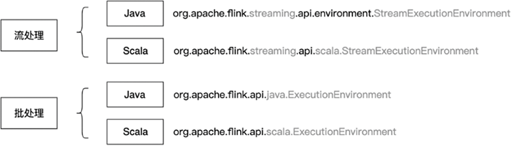

(skeleton)=
# Flink程序的骨架结构

:::{note}

本教程已出版为《Flink原理与实践》，感兴趣的读者请在各大电商平台购买！

<a href="https://item.jd.com/13154364.html">  </a>


:::

在进行详细的API介绍前，我们先回顾一下WordCount的案例，通过WordCount的代码结构，读者可以了解一个Flink程序的骨架结构。

我们知道，一个Java或Scala的程序入口一般是一个静态（static）的main函数。在main函数中，还需要定义下面几个核心步骤：

1. 初始化运行环境。

2. 读取一到多个数据源Source。

3. 根据业务逻辑对数据流进行Transformation转换。

4. 将结果输出到Sink。

5. 调用作业执行函数。

接下来我们对这五个步骤拆解分析。

## 设置执行环境

一个Flink作业必须依赖一个执行环境：

```java
// 创建Flink执行环境
StreamExecutionEnvironment env = StreamExecutionEnvironment.getExecutionEnvironment();
```

这行代码可以获取一个Flink流处理执行环境。Flink一般运行在一个集群上，执行环境是Flink程序运行的上下文，它提供了一系列作业与集群交互的方法，比如作业如何与外部世界交互。当调用`getExecutionEnvironment()`方法时，假如我们是在一个集群上提交作业，则返回集群的上下文，假如我们是在本地执行，则返回本地的上下文。本例中我们是进行流处理，在批处理场景则要获取DataSet API中批处理执行环境。

:::info
本例中我们是进行流处理，在批处理场景则要获取DataSet API中批处理执行环境。流处理和批处理的执行环境不同，流处理的执行环境名为`org.apache.flink.streaming.api.environment.StreamExecutionEnvironment`，批处理的执行环境名为`org.apache.flink.api.java.ExecutionEnvironment`。
:::

Scala和Java所需要引用的包也不相同，Scala需要调用`org.apache.flink.streaming.api.scala.StreamExecutionEnvironment`和`org.apache.flink.api.scala.ExecutionEnvironment`。

下图是批处理和流处理两种场景下，Java和Scala两种编程语言所需要引用的包。刚刚接触Flink的朋友很可能因为错误地引用导致出现莫名其妙的错误，一定要注意是否引用正确的包。



另外，使用Scala API时，应该按照下面的方式引用，否则会出现一些问题。

```scala
import org.apache.flink.streaming.api.scala._
```

Scala中的`_`就像Java中的`*`，是一种通配符。在这里使用`_`会引用`org.apache.flink.streaming.api.scala`下面的所有内容。

回到执行环境上，我们可以通过执行环境做很多设置。比如，`env.setParallelism(2)`告知执行环境整个作业的并行度为2；`env.disableOperatorChaining()`关闭算子链功能。

使用下面的设置可以创建一个基于本地的执行环境，这样我们使用IntelliJ Idea运行程序时，可以直接打开浏览器进入Flink Web UI查看运行的任务，本地的调试。

```java
Configuration conf = new Configuration();
// 访问http://localhost:8082 可以看到Flink Web UI
conf.setInteger(RestOptions.PORT, 8082);
// 创建本地执行环境，并行度为2
StreamExecutionEnvironment env = StreamExecutionEnvironment.createLocalEnvironment(2, conf);
```

此外，我们还可以在执行环境中设置一些时间属性等，配置Checkpoint等，我们将在后续章节中介绍这些功能。总之，执行环境是开发者和Flink交互的一个重要入口。

## 读取数据源

接着我们需要使用执行环境提供的方法读取数据源，读取数据源的部分统称为Source。数据源一般是消息队列或文件，我们也可以根据业务需求重写数据源，比如定时爬取网络中某处的数据。在本例中，我们使用`DataStream<String> stream = env.addSource(consumer);`来读取数据源，其中`consumer`是一个Kafka消费者，我们消费Kafka中的数据作为Flink的输入数据。绝大多数流处理实战场景可能都是消费其他消息队列作为Source。

我们将在第七章介绍如何使用各类Source。

## 进行转换操作

此时，我们已经获取了一个文本数据流，接下来我们就可以在数据流上进行有状态的计算了。我们一般调用Flink提供的各类算子，使用链式调用的方式，对一个数据流进行操作。经过各算子的处理，`DataStream`可能被转换为`KeyedStream`、`WindowedStream`、`JoinedStream`等不同的数据流结构。相比Spark RDD的数据结构，Flink的数据流结构确实更加复杂。

本例中，我们先对一行文本进行分词，形成`(word, 1)`这样的二元组，然后以单词为Key进行分组，并开启一个时间窗口，统计该窗口中某个单词出现的次数。在这个过程中，涉及到对数据流的分组、窗口和聚合操作。其中，窗口相关操作涉及到如何将数据流中的元素划分到不同的窗口，聚合操作涉及到使用一个状态来记录单词出现的次数，不断维护更新状态来对数据进行实时处理。本章我们重点介绍一些DataStream API，第五章将介绍时间上的操作，第六章将介绍如何使用状态以及如何做失败恢复。

## 结果输出

然后我们需要将前面的计算结果输出到外部系统。目的地可能是一个消息队列、文件系统或数据库，或其他自定义的输出方式。输出结果的部分统称为Sink。

本例中，我们的结果是窗口内的词频统计，它是一个`DataStream<Tuple2<String, Integer>>`的数据结构。我们调用`print`函数将这个数据流打印到标准输出（Standard Output）上。`print`主要是为调试使用的，在实战场景中，计算结果会输出到一个外部的数据库或下一个流处理作业。

## 执行

当定义好程序的Source、Transformation和Sink的业务逻辑后，程序并不会立即执行这些计算，我们还需要调用执行环境`execute()`方法来明确通知Flink去执行。Flink是延迟执行（Lazy Evaluation）的，即当程序明确调用`execute()`方法时，Flink才会将数据流图转化为一个`JobGraph`，提交给JobManager，JobManager根据当前的执行环境来执行这个作业。如果没有`execute()`方法，我们无法得到输出结果。

综上，一个Flink程序的核心业务逻辑主要包括：初始化执行环境、进行Source、Transformation和Sink操作，最后要调用执行环境的`execute()`方法。