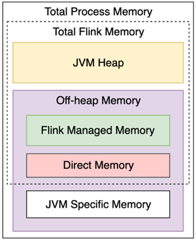
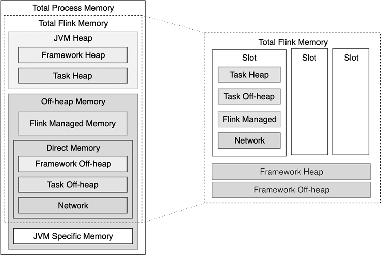

(configuration-file)=
# 配置文件

在前文的介绍中，我们曾多次提到Flink主目录下的`conf/flink-conf.yaml`文件，这个文件在作业配置中起到了至关重要的作用。

`flink-conf.yaml`是一个YAML配置文件，文件里使用Key-Value来设置一些参数。这个文件会被很多Flink进程读取，文件改动后，相关进程必须重启才能生效。例如，9.1节中提到，Standalone集群使用`bin/start-cluster.sh`脚本启动时，会读取Master的IP地址等。从官网下载的`flink-conf.yaml`文件已经对一些参数做了配置，这些配置主要针对的是单机环境，如果用户在集群环境中使用它，就需要修改一些配置。

本节将从Java、CPU、内存、磁盘等几大方向来介绍一些常用的配置。由于配置众多，无法一一列举，用户需要阅读Flink官方文档来进行更多个性化配置。

## 9.2.1 Java和类加载

在安装Java时，我们一般会将Java的路径以`$JAVA_HOME`的形式添加到环境变量`$PATH`中，默认情况下，Flink使用环境变量中的Java来运行程序。或者在`flink-conf.yaml`中设置`env.java.home`参数，使用安装到某个位置的Java。

`env.java.opts`设置所有Flink JVM进程参数，`env.java.opts.jobmanager`和`env.java.opts.taskmanager`分别设置JobManager和TaskManager的JVM进程参数。下面的配置使得所有Flink JVM进程使用并发垃圾回收器。

```yaml
env.java.opts: -XX:+UseConcMarkSweepGC -XX:CMSInitiatingOccupancyFraction=75
```

类加载（Classloading）对于很多应用开发者来说可能不需要过多关注，但是对于框架开发者来说需要非常小心。类加载的具体作用是将Java的`.class`文件加载到JVM虚拟机中。我们知道，当Java程序启动时，要使用`-classpath`参数设置从某些路径上加载所需要的依赖包。

```sh
$ java -classpath ".;./lib/*"
```

上面的命令将当前目录`.`和当前目录下的文件夹`./lib`两个路径加载进来，两个路径中的包都能被引用。一个Java程序需要引用的类库和包很多，包括JDK核心类库和各种第三方类库，JVM启动时，并不会一次性加载所有JAR包中的`.class`文件，而是动态加载。一个Flink作业一般主要加载下面两种类。

- **Java Classpath**：包括JDK核心类库和Flink主目录下`lib`文件夹中的类，其中`lib`文件夹中一般包含一些第三方依赖，比如Hadoop依赖。
- **用户类（User Code）**：用户编写的应用作业中的类，这些用户源码被打成JAR包，每提交一个作业时，相应的JAR包会被提交。

向集群提交一个Flink作业时，Flink会动态加载这些类，隐藏一些不必要的依赖，以尽量避免依赖冲突。常见的类依赖加载策略有两种：子类优先（Child-first）和父类优先（Parent-first）。

- **Child-first**：Flink会优先加载用户编写的应用作业中的类，然后再加载Java Classpath中的类。Parent-first：Flink会优先加载Java Classpath中的类。Flink默认使用Child-first策略，`flink-conf.yaml`的配置为：`classloader.resolve-order: child-first`。这种策略的好处是，用户在自己的应用作业中所使用的类库可以和Flink核心类库不一样，在一定程度上避免依赖冲突。这种策略适合绝大多数情况。

但是，Child-first策略在个别情况下也有可能出问题，这时候需要使用Parent-first策略，`flink-conf.yaml`的配置为：`classloader.resolve-order: parent-first`。Parent-first也是Java默认的类加载策略。

**注意**

有些类加载的过程中总会使用Parent-first策略。`classloader.parent-first-patterns.default`配置了必须使用Parent-first策略的类，如下。

```yaml
java.;scala.;org.apache.flink.;com.esotericsoftware.kryo;org.apache.hadoop.;
javax.annotation.;org.slf4j;org.apache.log4j;org.apache.logging;org.apache.
commons.logging;ch.qos.logback;org.xml;javax.xml;org.apache.xerces;org.w3c
```

`classloader.parent-first-patterns.default`列表最好不要随便改动，如果想要添加一些需要使用Parent-first的类，应该将那些类放在`classloader.parent-first-patterns.additional`中，类之间用分号`;`隔开。在加载过程中，`classloader.parent-first-patterns.additional`列表中的类会追加到`classloader.parent-first-patterns.default`列表后。

## 9.2.2 并行度与槽位划分

在第3章中我们已经介绍过Flink的JobManager和TaskManager的功能，其中TaskManager运行具体的计算。每个TaskManager占用一定的CPU和内存资源，一个TaskManager会被切分为一到多个Slot，Slot是Flink运行具体计算任务的最小单元。如果一个作业不进行任何优化，作业中某个算子的子任务会被分配到一个Slot上，这样会产生资源浪费。9.3节会介绍，多个子任务可以连接到一起，放在一个Slot中运行。最理想的情况下，一个Slot上运行着一个作业所有算子组成的流水线（Pipeline）。

前文中我们曾多次提到并行度的概念：如果一个作业的并行度为`parallelism`，那么该作业的每个算子都会被切分为`parallelism`个子任务。如果作业开启了算子链和槽位共享，那么这个作业需要`parallelism`个Slot。所以说，一个并行度为`parallelism`的作业至少需要`parallelism`个Slot。

在`flink-conf.yaml`中，`taskmanager.numberOfTaskSlots`配置一个TaskManager可以划分成多少个Slot。默认情况下它的值为1。对于Standalone集群来说，官方建议将参数值配置为与CPU核心数相等或成比例。例如，这个参数值可以配置为CPU核心数或CPU核心数的一半。TaskManager的内存会平均分配给每个Slot，但并没有将某个CPU核心绑定到某个Slot上。或者说，TaskManager中的多个Slot是共享多个CPU核心的，每个Slot获得TaskManager中内存的一部分。

关于如何配置`taskmanager.numberOfTaskSlots`参数，其实并没有一个绝对的准则。每个TaskManager下有一个Slot，那么该Slot会独立运行在一个JVM进程中；每个TaskManager下有多个Slot，那么多个Slot同时运行在一个JVM进程中。TaskManager中的多个Slot可以共享TCP连接、“心跳信息”以及一些数据结构，这在一定程度上减少了一些不必要的消耗。但是，我们要知道，Slot是以线程为基本计算单元的，线程的隔离性相对较差，一个线程中的错误可能导致整个JVM进程崩溃，运行在其上的其他Slot也会被波及。假如一个TaskManager下只有一个Slot，因为TaskManager是一个进程，进程之间的隔离度较好，但这种方式下，作业性能肯定会受到影响。

Standalone集群一般部署在物理机或多核虚拟机上，对CPU的资源划分粒度比较粗，所以官方建议把`taskmanager. numberOfTaskSlots`参数值配置为CPU核心数。YARN和Kubernetes这些调度平台对资源的划分粒度更细，可以精确地将CPU核心分配给Container，比如可以配置单CPU的Container节点给只有一个Slot的TaskManager使用。Flink YARN可以使用`yarn.containers.vcores`配置每个Container中CPU核心的数量，默认情况下它的值等于`taskmanager.numberOfTaskSlots`。Flink Kubernetes可以使用`kubernetes.taskmanager.cpu`配置单个TaskManager的CPU数量，默认情况下它的值等于`taskmanager.numberOfTaskSlots`。

总结下来，关于计算的并行划分，有两个参数是可以配置的：作业并行度和TaskManager中Slot的数量。作业的并行度可以在用户代码中配置，也可以在提交作业时通过命令行参数配置。TaskManager中Slot数量通过`taskManager.numberOfTaskSlots`配置。假设作业开启了算子链和槽位共享，该作业的TaskManager数量为：

```markdown
可以肯定的是，作业并行划分并不能一蹴而就，需要根据具体情况经过一些调优后才能达到最佳状态。这包括使用何种部署方式、部署时如何给TaskManager划分资源、如何配置`taskManager.
numberOfTaskSlots`，以及如何进行JVM调优等。在YARN和Kubernetes这样的部署环境上，一个简单、易上手的部署方式是：配置`taskmanager.numberOfTaskSlots`为1，给每个Container申请的CPU数量也为1，提交作业时根据作业的数据量大小配置并行度。Flink会根据上述参数分配足够的TaskManager运行该作业。
```

## 9.2.3 内存

### 1. 堆区内存和堆外内存

内存管理是每个Java开发者绕不开的话题。在JVM中，内存一般分为堆区（On-heap或Heap）内存和堆外（Off-heap）内存。在一个JVM程序中，堆区是被JVM虚拟化之后的内存空间，里面存放着绝大多数Java对象的实例，被所有线程共享。Java使用垃圾回收（Garbage Collection，GC）机制来清理内存中的不再使用的对象，堆区是垃圾回收的主要工作区域。内存经过垃圾回收之后，会产生大量不连续的空间，在某个时间点，JVM必须进行一次彻底的垃圾回收（Full GC）。Full GC时，垃圾回收器会对所有分配的堆区内存进行完整的扫描，扫描期间，绝大多数正在运行的线程会被暂时停止。这意味着，一次Full GC对一个Java应用造成的影响，跟堆区内存所存储的数据多少是成正比的，过大的堆区内存会影响Java应用的性能。例如，一个Java应用的堆区内存大小大于100GB，Full GC会产生分钟级的卡顿。

然而，在大数据时代，一个Java应用的堆区内存需求会很大，使用超过100GB大小的内存的情况比比皆是。因此，如果一个程序只使用堆区内存会产生一个悖论，即如果开辟的堆区内存过小，数据超过了内存限制，会抛出OutOfMemoryError异常（简称OOM问题），影响系统的稳定；如果堆区内存过大，GC时会经常卡顿，影响系统的性能。一种解决方案是将一部分内存对象迁移到堆外内存上。堆外内存直接受操作系统管理，可以被其他进程和设备访问，可以方便地开辟一片很大的内存空间，又能解决GC带来的卡顿问题，特别适合读/写操作比较频繁的场景。堆外内存虽然强大，但也有其负面影响，比如：堆外内存的使用、监控和调试更复杂，一些操作在堆外内存上会比较慢。

图9-5是对Flink内存模型的划分示意图。无论Flink的JobManager还是TaskManager都是一个JVM进程，整个Flink JVM进程的内存（见图9-5中Total Process Memory部分）包括两大部分：Flink占用的内存（见图9-5中Total Flink Memory部分）和JVM相关内存（见图9-5中JVM Specific Memory部分）。JVM Specific Memory是绝大多数Java程序都需要的一块内存区域，比如各个类的元数据会放在该区域。Total Flink Memory是Flink能使用到的内存，Total Flink Memory又包括JVM堆区内存（见图9-5中JVM Heap部分）和堆外内存（见图9-5中Off-heap Memory部分）。Off-heap Memory包括一些Flink所管理的内存（见图9-5中Flink Managed Memory部分），一般主要在TaskManager上给个别场景使用，Off-heap Memory另外一部分主要给网络通信缓存使用的内存（见图9-5中Direct Memory）。



**注意**

Flink 1.10开始对内存管理和设置进行了一次较大改动，相关的配置与之前的版本有明显不同，这里只介绍Flink 1.10版本以后的内存配置方法。从老版本迁移过来的朋友也应该注意修改内存配置，否则会出现错误。

从框架的角度来看，Flink将内存管理部分做了封装，用户在绝大多数情况下其实可以不用关注数据到底是如何写入内存的。但对于一些数据量较大的作业，了解Flink的内存模型还是非常有必要的。

### 2. Master的内存配置

在具体的内存管理问题上，Flink的Master和TaskManager有所区别。Master中的组件虽然比较多，但是整体来说占用内存不大。ResourceManager主要负责计算资源的管理、Dispatcher负责作业分发、JobManager主要协调某个作业的运行，这些组件无须直接处理数据。TaskManager主要负责数据处理。相比之下，Master对内存的需求没有那么苛刻，TaskManager对内存的需求很高。

一个最简单的配置方法是设置Master进程的Total Process Memory，参数项为`jobmanager.memory.process.size`。配置好Total Process Memory后，Flink有一个默认的分配比例，会将内存分配给各个子模块。另一个比较方便的方式是设置Total Flink Memory，即Flink可用内存，参数项为`jobmanager.memory.flink.size`。Total Flink Memory主要包括了堆区内存和堆外内存。堆区内存包含了Flink框架运行时本身所占用的内存空间，也包括JobManager运行过程中占用的内存。如果Master进程需要管理多个作业（例如Session部署模式下），或者某个作业比较复杂，作业中有多个算子，可以考虑增大Total Flink Memory。

### 3. TaskManager的内存配置

因为TaskManager涉及大规模数据处理，TaskManager的内存配置需要用户花费更多的精力。TaskManager的内存模型主要包括图9-6所示的组件。



如图9-6右侧所示单独对Total Flink Memory做了拆解。Total Flink Memory又包括JVM堆区内存和堆外内存。无论是堆区内存还是堆外内存，一部分是Flink框架所占用的，即Framework Heap和Framework Off-heap，这部分内存在计算过程中是给Flink框架使用的，作业实际所用到的Slot无法占用这部分资源。Flink框架所占用的内存一般比较固定。另一部分是当前计算任务所占用的，即Task Heap、Task Off-heap、Flink Managed Memory和Network。一个用户作业的绝大多数用户代码都运行在Task Heap区，因此Task Heap区的大小需要根据用户作业调整。

Flink专门开辟了一块堆外内存（见图9-6所示的Flink Managed Memory部分），用来管理一部分特殊的数据。Flink Managed Memory主要用途为：流处理下RocksDB的State Backend，批处理下排序、中间数据缓存等。RocksDB是第三方的插件，它不占用堆区内存。而MemoryStateBackend和FsStateBackend的本地状态是基于Task Heap区域的。如果流处理作业没有使用RocksDB，或者流处理作业没有状态数据，Flink Managed Memory这部分内存可以为零，以避免资源浪费。

Flink的网络传输基于Netty库，Netty以一块堆外内存（见图9-6所示的Network部分）作为缓存区。当TaskManager进程之间需要进行数据交换时，例如进行数据重分布或广播操作，数据会先缓存在Network区。假如数据量大，数据交换操作多，Network区的内存压力会明显增大。

可以看到，Flink的TaskManager内存模型并不简单。尽管Flink社区希望提供给用户最简单易用的默认配置，但使用一套配置处理各式各样的用户作业并不现实。Flink将内存配置分为不同粒度。

- **粗粒度的内存配置方法**：直接配置整个TaskManager JVM进程的内存。确切地说，是配置Total Process Memory或Total Flink Memory两者中的任意一个。这就相当于，我们配置好一个总量，其余各个子模块根据默认的比例获得其相应的内存大小。从图9-6中也可以看到，Total Process Memory比Total Flink Memory多了JVM Specific Memory。对于YARN或Kubernetes这种容器化的部署方式，给Total Process Memory申请内存更精确，相应的内存直接由资源管理器交付给了Container。对于Standalone集群，给Total Flink Memory申请内存更合适，相应的内存直接交付给了Flink本身。其中，Total Process Memory使用参数`taskmanager.memory.process.size`，Total Flink Memory使用参数`taskmanager.memory.flink.size`。

- **细粒度的内存配置方法**：同时配置Task Heap和Flink Managed Memory两个内存。根据前文的介绍，Task Heap和Flink Managed Memory不涉及Flink框架所需内存，不涉及JVM所需内存，它们只服务于某个计算任务。这个方法可以更明确地为最需要动态调整内存的地方分配资源，而其他组件会根据比例自动调整。其中，Task Heap由`taskmanager.memory.task.heap.size`参数配置，Flink Managed Memory由`taskmanager.memory.managed.size`参数配置。

至此，我们介绍了3种内存配置方法：两种方法从宏观角度配置内存总量，一种方法从用户作业角度配置该作业所需量。涉及下面几个参数。

- `taskmanager.memory.process.size`：Total Process Memory，包括Flink内存和JVM内存，是一个进程内存消耗的总量，各子模块会按照比例配置，常用在容器化部署方式上。
- `taskmanager.memory.flink.size`：Total Flink Memory，不包括JVM内存，只关乎Flink部分，其他模块会按照比例配置，常用在Standalone集群部署方式上。
- `taskmanager.memory.task.heap.size`和`taskmanager.memory.managed.size`：两个参数必须同时配置，细粒度地配置了一个作业所需内存，其他模块会按照比例配置。

**注意**

这3个参数不要同时配置，否则会引起冲突，导致作业运行失败。我们应该在这3个参数中选择一个来配置。

综上，FlinkFlink提供了大量的配置参数帮用户处理内存问题，但是实际场景千变万化，很难一概而论，内存的配置和调优也需要用户不断摸索和尝试。


## 9.2.4  磁盘
Flink进程会将一部分数据写入本地磁盘，比如：日志信息、RocksDB数据等。
io.tmp.dirs参数配置了数据写入本地磁盘的位置。该参数所指目录中存储了RocksDB创建的文件、缓存的JAR包，以及一些中间计算结果。默认使用了JVM的参数java.io.tmpdir，而该参数在Linux操作系统一般指的是/tmp目录。YARN、Kubernetes等会使用Container平台的临时目录作为该参数的默认值。

**注意**

io.tmp.dirs中存储的数据并不是用来做故障恢复的，但是如果这里的数据被清理，会对故障恢复产生较大影响。很多Linux发行版默认会定期清理/tmp目录，如果要在该操作系统上部署长期运行的Flink流处理作业，一定要记得将定期清理的开关关掉。
