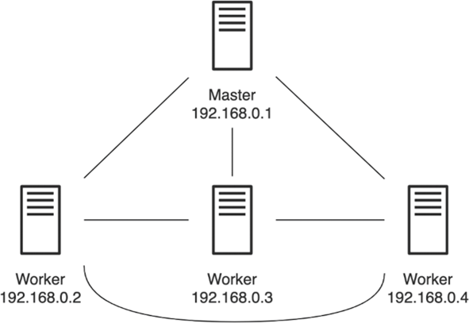
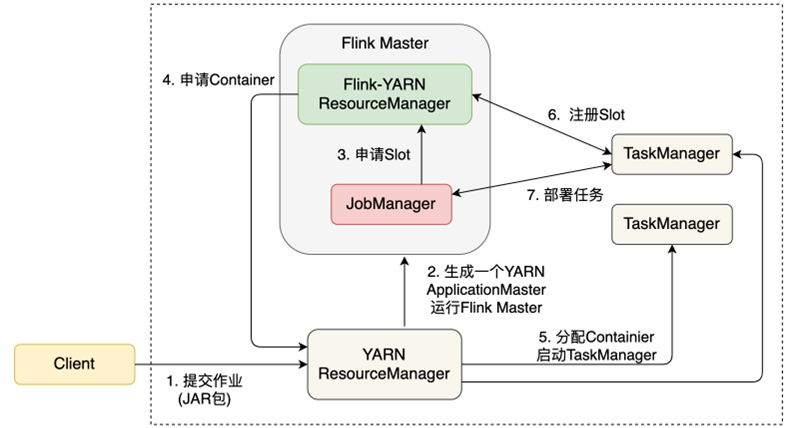
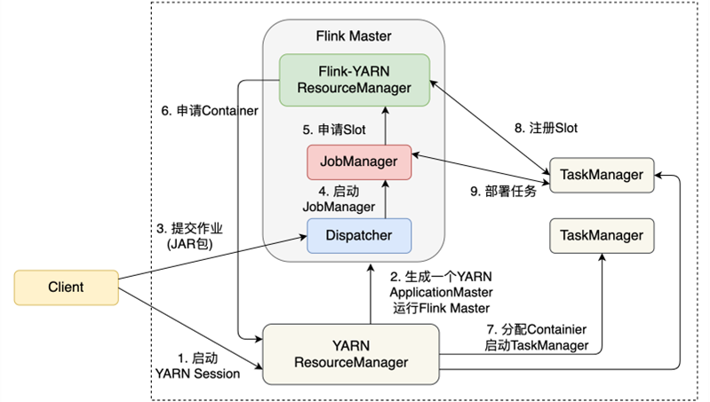
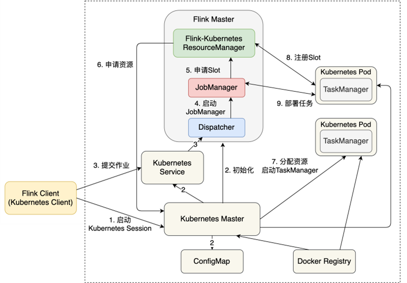

(flink-deployment-and-configuration)=
# Flink集群部署模式

当前，信息系统基础设施正在飞速发展，常见的基础设施包括物理机集群、虚拟机集群、容器集群等。为了兼容这些基础设施，Flink曾在1.7版本中做了重构，提出了第3章中所示的Master-Worker架构，该架构可以兼容几乎所有主流信息系统的基础设施，包括Standalone集群、Hadoop YARN集群或Kubernetes集群。

## 9.1.1 Standalone集群

一个Standalone集群包括至少一个Master进程和至少一个TaskManager进程，每个进程作为一个单独的Java JVM进程。其中，Master节点上运行Dispatcher、ResourceManager和JobManager，Worker节点将运行TaskManager。图9-1展示了一个4节点的Standalone集群，其中，IP地址为192.168.0.1的节点为Master节点，其他3个为Worker节点。



第2章的实验中，我们已经展示了如何下载和解压Flink，该集群只部署在本地，结合图9-1，本节介绍如何在一个物理机集群上部署Standalone集群。我们可以将解压后的Flink主目录复制到所有节点的相同路径上；也可以在一个共享存储空间（例如NFS）的路径上部署Flink，所有节点均可以像访问本地目录那样访问共享存储上的Flink主目录。此外，节点之间必须实现免密码登录：基于安全外壳协议（Secure Shell，SSH），将公钥拷贝到待目标节点，可以实现节点之间免密码登录。所有节点上必须提前安装并配置好JDK，将$JAVA_HOME放入环境变量。

我们需要编辑`conf/flink-conf.yaml`文件，将`jobmanager.rpc.address`配置为Master节点的IP地址192.168.0.1；编辑`conf/slaves`文件，将192.168.0.2、192.168.0.3和192.168.0.4等Worker节点的IP地址加入该文件中。如果每个节点除了IP地址外，还配有主机名（Hostname），我们也可以用Hostname替代IP地址来做上述配置。

综上，配置一个Standalone集群需要注意以下几点：
- 为每台节点分配固定的IP地址，或者配置Hostname，节点之间设置免密码SSH登录。
- 在所有节点上提前安装配置JDK，将`$JAVA_HOME`添加到环境变量中。
- 配置`conf/flink-conf.yaml`文件，设置`jobmanager.rpc.address`为Master节点的IP地址或Hostname。配置`conf/slaves`文件，将Worker节点的IP地址或Hostname添加进去。
- 将Flink主目录同步到所有节点的相同目录下，或者部署在一个共享目录上，共享目录可被所有节点访问。

接着，我们回到Master节点，进入Flink主目录，运行`bin/start-cluster.sh`。该脚本会在Master节点启动Master进程，同时读取`conf/slaves`文件，脚本会帮我们SSH登录到各节点上，启动TaskManager。至此，我们启动了一个Flink Standalone集群，我们可以使用Flink Client向该集群的Master节点提交作业。

```bash
$ ./bin/flink run -m 192.168.0.1:8081 ./examples/batch/WordCount.jar
```

可以使用`bin/stop-cluster.sh`脚本关停整个集群。

## 9.1.2 Hadoop YARN集群

Hadoop一直是很多公司首选的大数据基础架构，YARN也是经常使用的资源调度器。YARN可以管理一个集群的CPU和内存等资源，MapReduce、Hive或Spark都可以向YARN申请资源。YARN中的基本调度资源是容器（Container）。

注意：
YARN Container和Docker Container有所不同。YARN Container只适合JVM上的资源隔离，Docker Container则是更广泛意义上的Container。

为了让Flink运行在YARN上，需要提前配置Hadoop和YARN，这包括下载针对Hadoop的Flink，设置`HADOOP_CONF_DIR`和`YARN_CONF_DIR`等与Hadoop相关的配置，启动YARN等。网络上有大量相关教程，这里不赘述Hadoop和YARN的安装方法，但是用户需要按照9.5节介绍的内容来配置Hadoop相关依赖。

在YARN上使用Flink有3种模式：Per-Job模式、Session模式和Application模式。Per-Job模式指每次向YARN提交一个作业，YARN为这个作业单独分配资源，基于这些资源启动一个Flink集群，该作业运行结束后，相应的资源会被释放。Session模式在YARN上启动一个长期运行的Flink集群，用户可以向这个集群提交多个作业。Application模式在Per-Job模式上做了一些优化。图9-2展示了Per-Job模式的作业提交流程。



Client首先将作业提交给YARN的ResourceManager，YARN为这个作业生成一个ApplicationMaster以运行Fink Master，ApplicationMaster是YARN中承担作业资源管理等功能的组件。ApplicationMaster中运行着JobManager和Flink-YARN ResourceManager。JobManager会根据本次作业所需资源向Flink-YARN ResourceManager申请Slot资源。

注意：
这里有两个ResourceManager，一个是YARN的ResourceManager，它是YARN的组件，不属于Flink，它负责整个YARN集群全局层面的资源管理和任务调度；一个是Flink-YARN ResourceManager，它是Flink的组件，它负责当前Flink作业的资源管理。

Flink-YARN ResourceManager会向YARN申请所需的Container，YARN为之分配足够的Container作为TaskManager。TaskManager里有Flink计算所需的Slot，TaskManager将这些Slot注册到Flink-YARN ResourceManager中。注册成功后，JobManager将作业的计算任务部署到各TaskManager上。

下面的命令使用Per-Job模式启动单个作业。

```bash
$ ./bin/flink run -m yarn-cluster ./examples/batch/WordCount.jar
```

`-m yarn-cluster`表示该作业使用Per-Job模式运行在YARN上。

图9-3展示了Session模式的作业提交流程。



Session模式将在YARN上启动一个Flink集群，用户可以向该集群提交多个作业。

首先，我们在Client上，用`bin/yarn-session.sh`启动一个YARN Session。Flink会先向YARN ResourceManager申请一个ApplicationMaster，里面运行着Dispatcher和Flink-YARN ResourceManager，这两个组件将长期对外提供服务。当提交一个具体的作业时，作业相关信息被发送给了Dispatcher，Dispatcher会启动针对该作业的JobManager。

接下来的流程就与Per-Job模式几乎一模一样：JobManager申请Slot，Flink-YARN ResourceManager向YARN申请所需的Container，每个Container里启动TaskManager，TaskManager向Flink-YARN ResourceManager注册Slot，注册成功后，JobManager将计算任务部署到各TaskManager上。如果用户提交下一个作业，那么Dispatcher启动新的JobManager，新的JobManager负责新作业的资源申请和任务调度。

下面的命令本启动了一个Session，该Session的JobManager内存大小为1024MB，TaskManager内存大小为4096MB。

```bash
$ ./bin/yarn-session.sh -jm 1024m -tm 4096m
```

启动后，屏幕上会显示Flink WebUI的连接信息。例如，在一个本地部署的YARN集群上创建一个Session后，假设分配的WebUI地址为：`http://192.168.31.167:54680/`。将地址复制到浏览器，打开即显示Flink WebUI。

之后我们可以使用`bin/flink`在该Session上启动一个作业。

```bash
$ ./bin/flink run ./examples/batch/WordCount.jar
```

上述提交作业的命令没有特意指定连接信息，所提交的作业会直接在Session中运行，这是因为Flink已经将Session的连接信息记录了下来。从 Flink WebUI 页面上可以看到，刚开始启动时，UI上显示 Total/Available Task Slots 为0，Task Managers也为0。随着作业的提交，资源会动态增加：每提交一个新的作业，Flink-YARN ResourceManager会动态地向YARN ResourceManager申请资源。

比较Per-Job模式和Session模式发现：Per-Job模式下，一个作业运行完后，JobManager、TaskManager都会退出，Container资源会释放，作业会在资源申请和释放上消耗时间；Session模式下，Dispatcher和Flink-YARN ResourceManager是可以被多个作业复用的。无论哪种模式，每个作业都有一个JobManager与之对应，该JobManager负责单个作业的资源申请、任务调度、Checkpoint等协调性功能。Per-Job模式更适合长时间运行的作业，作业对启动时间不敏感，一般是长期运行的流处理任务。Session模式更适合短时间运行的作业，一般是批处理任务。

除了Per-Job模式和Session模式，Flink还提供了一个Application模式。Per-Job和Session模式作业提交的过程比较依赖Client，一个作业的main()方法是在Client上执行的。main()方法会将作业的各个依赖下载到本地，生成JobGraph，并将依赖以及JobGraph发送到Flink集群。在Client上执行main()方法会导致Client的负载很重，因为下载依赖和将依赖打包发送到Flink集群都对网络带宽有一定要求，执行main()方法会加重CPU的负担。而且在很多企业，多个用户会共享一个Client，多人共用加重了Client的压力。为了解决这个问题，Flink的Application模式允许main()方法在JobManager上执行，这样可以分担Client的压力。在资源隔离层面上，Application模式与Per-Job模式基本一样，相当于为每个作业应用创建一个Flink集群。

具体而言，我们可以用下面的代码，基于Application模式提交作业。

```bash
$ ./bin/flink run-application -t yarn-application \
  -Djobmanager.memory.process.size=2048m \
  -Dtaskmanager.memory.process.size=4096m \
  -Dyarn.provided.lib.dirs="hdfs://myhdfs/my-remote-flink-dist-dir" \
  ./examples/batch/WordCount.jar
```

在上面这段提交作业的代码中，`run-application`表示使用Application模式，`-D`前缀加上参数配置来设置一些参数，这与Per-Job模式和Session模式的参数设置稍有不同。为了让作业下载各种依赖，可以向HDFS上传一些常用的JAR包，本例中上传路径是`hdfs://myhdfs/my-remote-flink-dist-dir`，然后使用`-Dyarn.provided.lib.dirs`告知Flink上传JAR包的地址，Flink的JobManager会前往这个地址下载各种依赖。

## 9.1.3 Kubernetes集群

Kubernetes（简称K8s）是一个开源的Container编排平台。近年来，Container以及Kubernetes大行其道，获得了业界的广泛关注，很多信息系统正在逐渐将业务迁移到Kubernetes上。

在Flink 1.10之前，Flink的Kubernetes部署需要用户对Kubernetes各组件和工具有一定的了解，而Kubernetes涉及的组件和概念较多，学习成本较高。和YARN一样，Flink Kubernetes部署方式支持Per-Job和Session两种模式。为了进一步减小Kubernetes部署的难度，Flink 1.10提出了原生Kubernetes部署，同时也保留了之前的模式。新的Kubernetes部署非常简单，将会成为未来的趋势，因此本小节只介绍这种原生Kubernetes部署方式。

注意：
原生Kubernetes部署是Flink 1.10推出的新功能，还在持续迭代中，一些配置文件和命令行参数有可能在未来的版本迭代中发生变化，读者使用前最好阅读最新的官方文档。

在使用Kubernetes之前，需要确保Kubernetes版本为1.9以上，配置`~/.kube/config`文件，提前创建用户，并赋予相应权限。

Flink原生Kubernetes部署目前支持Session模式和Application模式。Session模式是在Kubernetes集群上启动Session，然后在Session中提交多个作业。未来的版本将支持原生Kubernetes Per-Job模式。图9-4所示为一个原生Kubernetes Session模式的作业提交流程。



如图9-4中所示的第1步，我们用`bin/kubernetes-session.sh`启动一个Kubernetes Session，Kubernetes相关组件将进行初始化，Kubernetes Master、ConfigMap和Kubernetes Service等模块生成相关配置，剩下的流程与YARN的Session模式几乎一致。Client提交作业到Dispatcher，Dispatcher启动一个JobManager，JobManager向Flink-Kubernetes ResourceManager申请Slot，Flink-Kubernetes ResourceManager进而向Kubernetes Master申请资源。Kubernetes Master分配资源，启动Kubernetes Pod，运行TaskManager，TaskManager向Flink-Kubernetes ResourceManager注册Slot，这个作业可以基于这些资源进行部署。

如图9-4中所示的第1步，我们需要启动一个Flink Kubernetes Session，其他参数需要参考Flink官方文档中的说明，相关命令如下。

```bash
$ ./bin/kubernetes-session.sh \
  -Dkubernetes.cluster-id=<ClusterId> \
  -Dkubernetes.container.image=<image> \
  -Dtaskmanager.memory.process.size=4096m \
  -Dkubernetes.taskmanager.cpu=2 \
  -Dtaskmanager.numberOfTaskSlots=4 \
  -Dresourcemanager.taskmanager-timeout=3600000
```

上面的命令启动了一个名为ClusterId的Flink Kubernetes Session集群，集群中的每个TaskManager有2个CPU、4096MB的内存、4个Slot。ClusterId是该Flink Kubernetes Session集群的标识，实际使用时我们需要设置一个名字，如果不进行设置，Flink会给我们分配一个名字。

为了使用Flink WebUI，可以使用下面的命令进行端口转发。

```bash
$ kubectl port-forward service/<ClusterID> 8081
```

在浏览器中打开地址`http://127.0.0.1:8001`，就能看到Flink的WebUI了。与Flink YARN Session一样，刚开始所有的资源都是0，随着作业的提交，Flink会动态地向Kubernetes申请更多资源。

我们继续使用`bin/flink`向这个Session集群中提交作业。

```bash
$ ./bin/flink run -d -e kubernetes-session \
  -Dkubernetes.cluster-id=<ClusterId> examples/streaming/WindowJoin.jar
```

可以使用下面的命令关停这个Flink Kubernetes Session集群。

```bash
$ echo 'stop' | ./bin/kubernetes-session.sh \
  -Dkubernetes.cluster-id=<ClusterId> \
  -Dexecution.attached=true
```

原生Kubernetes也有Application模式，Kubernetes Application模式与YARN Application模式类似。使用时，需要先将作业打成JAR包，放到Docker镜像中，代码如下。

```dockerfile
FROM flink
RUN mkdir -p $FLINK_HOME/usrlib
COPY /path/of/my-flink-job-*.jar /opt/flink/usrlib/my-flink-job.jar
```

然后使用下面的代码行提交作业。

```bash
$ ./bin/flink run-application -p 8 -t kubernetes-application \
  -Dkubernetes.cluster-id=<ClusterId> \
  -Dtaskmanager.memory.process.size=4096m \
  -Dkubernetes.taskmanager.cpu=2 \
  -Dtaskmanager.numberOfTaskSlots=4 \
  -Dkubernetes.container.image=<CustomImageName> \
  local:///opt/flink/usrlib/my-flink-job.jar
```

其中，`-Dkubernetes.container.image`用来配置自定义的镜像，`local:///opt/flink/usrlib/my-flink-job.jar`表示JAR包在镜像中的位置。
