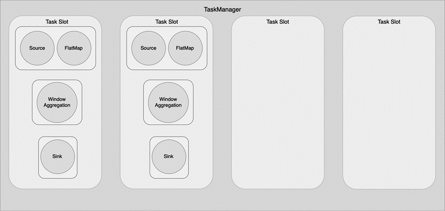
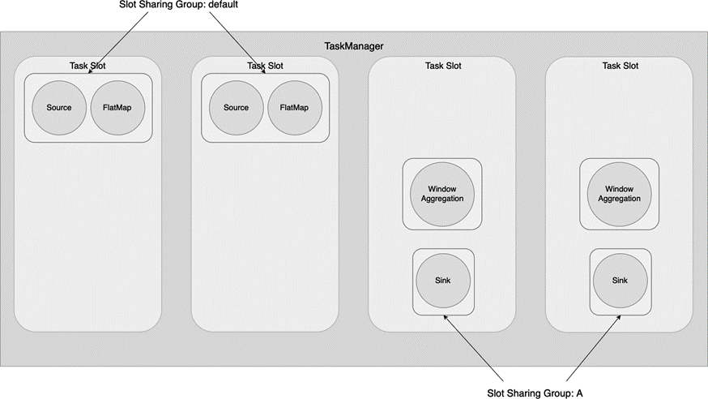

(operator-chaining-and-slot-sharing)=
# 算子链与槽位共享

在第3章中我们曾介绍了算子链和槽位共享的概念。默认情况下，这两个功能都是开启的。

## 9.3.1 设置算子链

Flink会使用算子链将尽可能多的上、下游算子链接到一起，链接到一起的上、下游算子会被捆绑到一起，作为一个线程执行。假如两个算子不进行链接，那么这两个算子间的数据通信存在序列化和反序列化，通信成本较高，所以说算子链可以在一定程度上提高资源利用率。

**注意**

Flink无法把所有算子都链接到一起。上游算子将所有数据前向传播到下游算子上，数据不进行任何交换，那么这两个算子可以被链接到一起。比如，先进行`filter()`，再进行`map()`，这两个算子可以被链接到一起。Flink源码`org.apache.flink.streaming.api.graph.StreamingJobGraphGenerator`中的`isChainable()`方法定义了何种情况可以进行链接，感兴趣的读者可以阅读一下相关代码。

另外一些情况下，算子不适合链接在一起，比如两个算子的负载都很高，这时候应该让两个算子拆分到不同的Slot上执行。下面的代码从整个执行环境层面关闭了算子链。

```java
StreamExecutionEnvironment env = ...

env.disableOperatorChaining();
```

关闭算子链之后，我们可以使用`startNewChain()`方法，根据需要对特定的算子进行链接。

```java
DataStream<X> result = input
  .filter(new Filter1())
  .map(new Map1())
  // 开启新的算子链
  .map(new Map2()).startNewChain()
  .filter(new Filter2());
```

上面的例子中，`Filter1`和`Map1`被链接到了一起，`Map2`和`Filter2`被链接到了一起。
也可以使用`disableChaining()`方法，对当前算子禁用算子链。

```java
DataStream<X> result = input
  .filter(new Filter1())
  .map(new Map1())
  // 禁用算子链
  .map(new Map2()).disableChaining();
```

上面的例子中，`Filter1`和`Map1`被链接到了一起，`Map2`被分离出来。

## 9.3.2 设置槽位共享

第3章中我们提到，Flink默认开启了槽位共享，从Source到Sink的所有算子子任务可以共享一个Slot，共享计算资源。或者说，从Source到Sink的所有算子子任务组成的Pipeline共享一个Slot。我们仍然以第3章使用的WordCount程序为例，整个TaskManager下有4个Slot，我们设置作业的并行度为2，其作业的执行情况如图9-7所示。可以看到，一个Slot中包含了从Source到Sink的整个Pipeline。图9-7中Source和FlatMap两个算子被放在一起是因为默认开启了算子链。



跟算子链一样，过多的计算任务集中在一个Slot，有可能导致该Slot的负载过大。每个算子都有一个槽位共享组（Slot Sharing Group）。默认情况下，算子都会被分到`default`组中，也就意味着在最终的物理执行图中，从Source到Sink上、下游的算子子任务可以共享一个Slot。我们可以用`slotSharingGroup(String)`方法将某个算子分到特定的组中。例如，下面的代码把WordCount程序中的`WindowAggregation`算子划分到名为`A`的组中。

```java
stream.timeWindow(...).sum(...).slotSharingGroup("A");
```

图9-8 展示了这个作业的执行情况，Window Aggregation和Sink都被划分到另外的Slot里执行。这里需要注意的是，我们没有明确给Sink设置Slot Sharing Group，Sink继承了前序算子（Window Aggregation）的Slot Sharing Group，与之一起划分到同一组。

第3章中我们提到，未开启算子链和槽位共享的情况下，一个算子子任务应该占用一个Slot。算子链和槽位共享可以让更多算子子任务共享一个Slot。默认情况下算子链和槽位共享是开启的，所以可以让图9-7中所示的从Source到Sink的Pipeline都共享一个Slot。如果一个作业的并行度为`parallelism`，该作业至少需要个数为`parallelism`的Slot。自定义算子链和槽位共享会打断算子子任务之间的共享，当然也会使该作业所需要的Slot数量大于`parallelism`。

