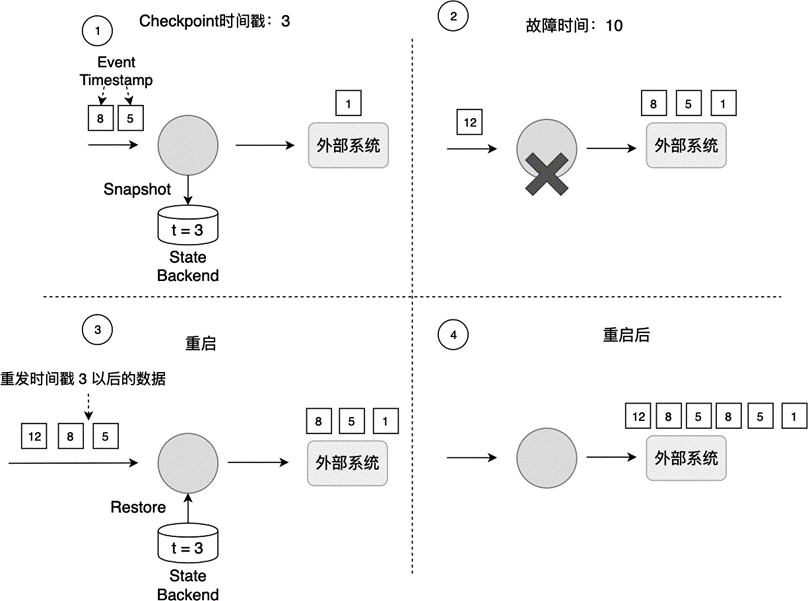
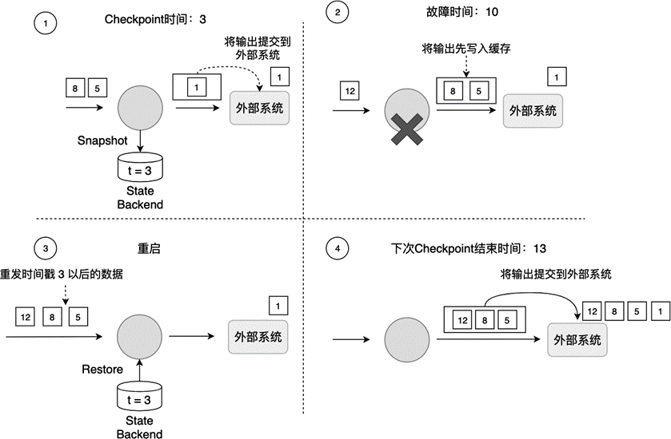

(Exactly-Once-guarantee)=
# Flink端到端的Exactly-Once保障

## 7.1.1 故障恢复与一致性保障

在流处理系统中，确保每条数据只被处理一次（Exactly-Once）是一种理想情况。然而，现实中的系统经常因各种意外因素发生故障，如流量激增、网络抖动等。Flink通过重启作业、读取Checkpoint数据、恢复状态和重新执行计算来处理这些故障。

Checkpoint和故障恢复过程保证了内部状态的一致性，但可能导致数据重发。如图7-1所示，假设最近一次Checkpoint的时间戳是3，系统在时间戳10处发生故障。在3到10之间处理的数据（如时间戳5和8的数据）需要重新处理。

Flink的Checkpoint过程保证了作业内部的数据一致性，主要通过备份以下两类数据：
1. 作业中每个算子的状态。
2. 输入数据的偏移量Offset。

数据重发类似于观看直播比赛的重播（Replay），但这可能导致时间戳3至10之间的数据被重发，从而引发At-Least-Once问题。为了实现端到端的Exactly-Once保障，需要依赖Source的重发功能和Sink的幂等写或事务写。

## 7.1.2 幂等写

幂等写（Idempotent Write）是指多次向系统写入数据只产生一次结果影响。例如，向HashMap插入同一个(Key, Value)二元组，只有第一次插入会改变HashMap，后续插入不会改变结果。

Key-Value数据库如Cassandra、HBase和Redis常作为Sink来实现端到端的Exactly-Once保障。但幂等写要求(Key, Value)必须是确定性计算的。例如，如果Key是`name + curTimestamp`，每次重发时生成的Key不同，导致多次结果。如果Key是`name + eventTimestamp`，则即使重发，Key也是确定的。

Key-Value数据库作为Sink可能遇到时间闪回问题。例如，重启后，之前提交的数据可能被错误地认为是新的操作，导致数据不一致。只有当所有数据重发完成后，数据才恢复一致性。

## 7.1.3 事务写

事务（Transaction）是数据库系统解决的核心问题。Flink借鉴了数据库中的事务处理技术，结合Checkpoint机制来保证Sink只对外部输出产生一次影响。

Flink的事务写（Transaction Write）是指，Flink先将待输出的数据保存，暂时不提交到外部系统；等到Checkpoint结束，所有算子的数据一致时，再将之前保存的数据提交到外部系统。如图7-2所示，使用事务写可以避免时间戳5的数据多次产生输出并提交到外部系统。

Flink提供了两种事务写实现方式：预写日志（Write-Ahead-Log，WAL）和两阶段提交（Two-Phase-Commit，2PC）。这两种方式的主要区别在于：WAL方式使用Operator State缓存待输出的数据；如果外部系统支持事务（如Kafka），可以使用2PC方式，待输出数据被缓存在外部系统。

事务写能提供端到端的Exactly-Once保障，但牺牲了延迟，因为输出数据不再实时写入外部系统，而是分批次提交。开发者需要权衡不同需求。