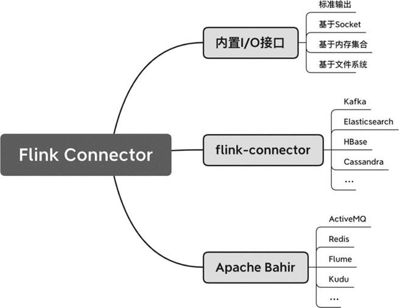

(flink-connector)=
# Flink中常用的Connector

本节将对Flink常用的Connector做一些概括性的介绍，主要包括内置输入/输出（Input/Output，I/O）接口、flink-connector项目所涉及的Connector、Apache Bahir所提供的Connector等，如图7-5所示。



Flink支持了绝大多数的常见大数据系统，从系统的类型上，包括了消息队列、数据库、文件系统等；从具体的技术上，包括了Kafka、Elasticsearch、HBase、Cassandra、JDBC、Kinesis、Redis等。各个大数据系统使用起来略有不同，接下来将重点介绍一下Flink内置I/O接口和Flink Kafka Connector，这两类Connector被广泛应用在很多业务场景中，具有很强的代表性。

## 7.3.1 内置I/O接口

之所以给这类Connector起名为内置I/O接口，是因为这些接口直接集成在了Flink的核心代码中，无论在任何环境中，我们都可以调用这些接口进行数据输入/输出操作。与内置I/O接口相对应的是flink-connector子项目以及Apache Bahir项目中的Connector，flink-connector虽然是Flink开源项目的一个子项目，但是并没有直接集成到二进制包（我们在第2章下载安装的Flink安装包）中。因此，使用Flink的内置I/O接口，一般不需要额外添加依赖，使用其他Connector需要添加相应的依赖。

Flink的内置I/O接口如下：

- 基于Socket的Source和Sink。
- 基于内存集合的Source。
- 输出到标准输出的Sink。
- 基于文件系统的Source和Sink。

在前文中，我们其实已经使用过这里提到的接口，比如从内存集合中创建数据流并将结果输出到标准输出。像Socket、内存集合和打印这3类接口非常适合调试。此外，文件系统被广泛用于大数据的持久化，是大数据架构中经常涉及的一种组件。下面我们将再次梳理一下这些接口，并重点介绍一下基于文件系统的Source和Sink。

### 1. 基于Socket的Source和Sink

我们可以从Socket数据流中读取和写入数据。

```java
// 读取Socket中的数据，数据流数据之间用\n来切分
env.socketTextStream(hostname, port, "\n");

// 向Socket中写数入据，数据以SimpleStringSchema序列化
stream.writeToSocket(outputHost, outputPort, new SimpleStringSchema());
```

由于Socket不能保存Offset，也无法实现数据重发，因此以它作为Connector可能会导致故障恢复时的数据丢失，只能提供At-Most-Once的投递保障。这种方式非常适合用来调试，开源工具nc可以创建Socket数据流，结合Flink的Socket接口可以用来快速验证一些逻辑。

此外，Socket Source输入数据具有时序性，适合用来调试与时间和窗口有关的程序。

注意，使用Socket时，需要提前启动相应的Socket端口，以便Flink能够建立Socket连接，否则将抛出异常。

### 2. 基于内存集合的Source

最常见调试方式是在内存中创建一些数据列表，并直接写入Flink的Source。

```java
DataStream<Integer> sourceDataStream = env.fromElements(1, 2, 3);
```

它内部调用的是：`fromCollection(Collection<T> data, TypeInformation<T> typeInfo)`。`fromCollection()`基于Java的Collection接口。对于一些复杂的数据类型，我们用Java的Collection来创建数据，并写到Flink的Source里。

```java
// 获取数据类型
TypeInformation<T> typeInfo = ...
DataStream<T> collectionStream = env.fromCollection(Arrays.asList(data), typeInfo);
```

### 3. 输出到标准输出的Sink

`print()`和`printToErr()`分别将数据流输出到标准输出流（STDOUT）和标准错误流（STDERR）。这两个方法会调用数据的`toString()`方法，将内存对象转换成字符串，因此如果想进行调试、查看结果，一定要实现数据的`toString()`方法。Java的POJO类要重写`toString()`方法，Scala的case class已经有内置的`toString()`方法，无须实现。

```java
public class StockPrice {
    public String symbol;
    public double price;
    public long ts;
    public int volume;
    public String mediaStatus;

    ...

    @Override
    public String toString() {
        return "(" + this.symbol + "," +
                this.price + "," + this.ts +
                "," + this.volume + "," +
                this.mediaStatus + ")";
    }
}
```

`print()`和`printToErr()`方法实际在TaskManager上执行，如果并行度大于1，Flink会将算子子任务的ID一起输出。比如，在IntelliJ IDEA中执行程序，可以得到类似下面的结果，每行输出前都有一个数字，该数字表示相应方法实际在哪个算子子任务上执行。

```
1> 490894,1061719,4874384,pv,1512061207
1> 502030,4129946,1567637,pv,1512061207
4> 226011,4228265,3159480,pv,1512057930
4> 228530,3404444,64179,pv,1512057930
6> 694940,4531940,4217906,pv,1512058952
...
```

### 4. 基于文件系统的Source和Sink

#### (1) 基于文件系统的Source

文件系统一般用来存储数据，为批处理提供输入或输出，是大数据架构中最为重要的组件之一。比如，消息队列可能将一些日志写入文件系统进行持久化，批处理作业从文件系统中读取数据进行分析等。在Flink中，基于文件系统的Source和Sink可以从文件系统中读取和输出数据。

Flink对各类文件系统都提供了支持，包括本地文件系统以及挂载到本地的网络文件系统（Network File System，NFS）、Hadoop HDFS、Amazon S3、阿里云OSS等。Flink通过路径中的文件系统描述符来确定该文件路径使用什么文件系统，例如`file:///some/local/file`或者`hdfs://host:port/file/path`。

下面的代码从一个文件系统中读取一个文本文件，文件读入后以字符串的形式存在，并生成一个`DataStream<String>`。

```java
StreamExecutionEnvironment env = StreamExecutionEnvironment.getExecutionEnvironment();
String textPath = ...
// readTextFile()方法默认以UTF-8编码格式读取文件
DataStream<String> text = env.readTextFile(textPath);
```

Flink在内部实际调用的是一个支持更多参数的接口。

```java
/**
  * 从filePath文件中读取数据
  * FileInputFormat 定义文件的格式
  * watchType 检测文件路径下的内容是否有更新
  * interval 检测间隔
  */
public <OUT> DataStreamSource<OUT> readFile(
                        FileInputFormat<OUT> inputFormat,
                        String filePath,
                        FileProcessingMode watchType,
                        long interval);
```

上述方法可以读取一个路径下的所有文件。`FileInputFormat`定义了输入文件的格式，比如一个纯文本文件`TextInputFormat`，后文还将详细介绍这个接口。参数`filePath`是文件路径。如果这个路径指向一个文件，Flink将读取这个文件，如果这个路径是一个目录，Flink将读取目录下的文件。基于`FileProcessingMode`，Flink提供了如下两种不同的读取文件的模式。

- `FileProcessingMode.PROCESS_ONCE`模式只读取一遍某个目录下的内容，读取完后随即退出。
- `FileProcessingMode.PROCESS_CONTINUOUSLY`模式每隔`interval`毫秒周期性地检查`filePath`路径下的内容是否有更新，如果有更新，重新读取里面的内容。

下面的代码展示了如何调用`FileInputFormat`接口。

```java
// 文件路径
String filePath = ...

// 文件为纯文本格式
TextInputFormat textInputFormat = new TextInputFormat(new org.apache.flink.core.fs.Path(filePath));

// 每隔100毫秒检测一遍
DataStream<String> inputStream = env.readFile(textInputFormat, filePath, FileProcessingMode.PROCESS_CONTINUOUSLY, 100);
```

Flink在实现文件读取时，增加了一个专门检测文件路径的线程。这个线程启动后定时检测路径下的任何修改，比如是否有文件被修改，或文件夹是否添加了新内容。确切地说，这个线程检测文件的修改时间（Modified Time）是否发生了变化。`FileProcessingMode.PROCESS_CONTINUOUSLY`模式下Flink每隔`interval`毫秒周期性地检测文件的修改时间；`FileProcessingMode.PROCESS_ONCE`只检测一次，不周期性地检测。

注意

重新读取文件内容会影响端到端的Exactly-Once一致性。因为检测更新是基于文件的修改时间，如果我们往一个文件中追加数据，文件的修改时间会发生变化，该文件下次检测时会被重新读取，导致一条数据可能会被多次处理。

`FileInputFormat`是读取文件的基类，继承这个基类可以实现不同类型的文件读取，包括纯文本文件。`TextInputFormat`是`FileInputFormat`的一个实现，`TextInputFormat`按行读取文件，文件以纯文本的序列化方式打开。Flink也提供了`AvroInputFormat`、`OrcInputFormat`、`ParquetInputFormat`等其他大数据架构所采用的文件格式，这些文件格式比起纯文本文件的性能更好，它们的读/写方式也各有不同。

考虑到数据的容量比较大，在实现文件读取的过程中，Flink会判断`filePath`路径下的文件能否切分。假设这个作业的并行度是`n`，而且文件能够切分，检测线程会将读入的文件切分成`n`份，后续启动`n`个并行的文件读取实例读取这`n`份切分文件。

#### (2) 基于文件系统的Sink

我们可以使用`writeAsText(String path)`、`writeAsText(String path, WriteMode writeMode)`和`writeUsingOutputFormat(OutputFormat<T> format)`等方法来将文件输出到文件系统。`WriteMode`可以为`NO_OVERWRITE`和`OVERWRITE`，即是否覆盖原来路径里的内容。`OutputFormat`与`FileInputFormat`类似，表示目标文件的文件格式。在最新的Flink版本中，这几个输出到文件系统的方法被标记为`@Deprecated`，表示未来将被弃用，主要考虑到这些方法没有参与Flink的Checkpoint过程中，无法提供Exactly-Once保障。这些方法适合用于本地调试。

在生产环境中，为了保证数据的一致性，官方建议使用`StreamingFileSink`接口。下面这个例子展示了如何将一个文本数据流输出到一个目标路径上。这里用到的是一个非常简单的配置，包括一个文件路径和一个`Encoder`。`Encoder`可以将数据编码以便对数据进行序列化。

```java
DataStream<Address> stream = env.addSource(...);

// 使用StreamingFileSink将DataStream输出为一个文本文件
StreamingFileSink<String> fileSink = StreamingFileSink
  .forRowFormat(new Path("/file/base/path"), new SimpleStringEncoder<String>("UTF-8"))
  .build();
stream.addSink(fileSink);
```

`StreamingFileSink`主要支持两类文件，一种是行式存储，一种是列式存储。我们平时见到的很多数据是行式存储的，即在文件的末尾追加新的行。列式存储在某些场景下的性能很高，它将一批数据收集起来，批量写入。行式存储和列式存储的接口如下。

- 行式存储：`StreamingFileSink.forRowFormat(basePath, rowEncoder)`。
- 列式存储：`StreamingFileSink.forBulkFormat(basePath, bulkWriterFactory)`。

回到刚才的例子上，它使用了行式存储，`SimpleStringEncoder`是Flink提供的预定义的`Encoder`，它通过数据流的`toString()`方法将内存数据转换为字符串，将字符串按照UTF-8编码写入输出中。`SimpleStringEncoder<String>`可以用来编码转换字符串数据流，`SimpleStringEncoder<Long>`可以用来编码转换长整数数据流。

如果数据流比较复杂，我们需要自己实现一个`Encoder`。代码清单 7-7中的数据流是一个`DataStream<Tuple2<String, Integer>>`，我们需要实现`encode()`方法，将每个数据编码。

```java
// 将一个二元组数据流编码并序列化
static class Tuple2Encoder implements Encoder<Tuple2<String, Integer>> {
    @Override
    public void encode(Tuple2<String, Integer> element, OutputStream stream) throws IOException {
        stream.write((element.f0 + '@' + element.f1).getBytes(StandardCharsets.UTF_8));
        stream.write('\n');
    }
}
```

对于列式存储，也需要一个类似的`Encoder`，Flink称之为`BulkWriter`，本质上将数据序列化为列式存储所需的格式。比如我们想使用Parquet格式，代码如下。

```java
DataStream<Datum> stream = ...;

StreamingFileSink<Datum> fileSink = StreamingFileSink
  .forBulkFormat(new Path("/file/base/path"), ParquetAvroWriters.forReflectRecord(Datum.class))
  .build();

stream.addSink(fileSink);
```

考虑到大数据场景下，输出数据量会很大，而且流处理作业需要长时间执行，`StreamingFileSink`的具体实现过程中使用了桶的概念。桶可以理解为输出路径的一个子文件夹。如果不做其他设置，Flink按照时间来将输出数据分桶，会在输出路径下生成类似下面的文件夹结构。

```
/file/base/path
└── 2020-02-25--15
    ├── part-0-0.inprogress.92c7be6f-8cfc-4ca3-905b-91b0e20ba9a9
    ├── part-1-0.inprogress.18f9fa71-1525-4776-a7bc-fe02ee1f2dda
```

目录和文件名实际上是按照下面的结构来命名的。

```
[base-path]/[bucket-path]/part-[task-id]-[id]
```

最顶层的文件夹是我们设置的输出目录，第二层是桶，Flink将当前的时间作为`bucket-path`桶名。实际输出时，Flink会启动多个并行的实例，每个实例有自己的`task-id`，`task-id`被添加在了`part`之后。

我们也可以自定义数据分配的方式，将某一条数据分配到相应的桶中。

```java
StreamingFileSink<String> fileSink = StreamingFileSink
  .forRowFormat(new Path("/file/path"), new SimpleStringEncoder<String>("UTF-8"))
  .withBucketAssigner(new DateTimeBucketAssigner<>())
  .build();
```

上述的文件夹结构中，有“inprogress”字样，这与`StreamingFileSink`能够提供的Exactly-Once保障有关。一份数据从生成到最终可用需要经过3个阶段：进行中（In-progress）、等待（Pending）和结束（Finished）。当数据刚刚生成时，文件处于In-progress阶段；当数据已经准备好（比如单个part文件足够大），文件被置为Pending阶段；下次Checkpoint执行完，整个作业的状态数据是一致的，文件最终被置为Finished阶段，Finished阶段的文件名没有“inprogress”的字样。从这个角度来看，`StreamingFileSink`和Checkpoint机制结合，能够提供Exactly-Once保障。

## 7.3.2 Flink Kafka Connector

在第1章中我们曾提到，Kafka是一个消息队列，它可以在Flink的上游向Flink发送数据，也可以在Flink的下游接收Flink的输出。Kafka是一个很多公司都采用的消息队列，因此非常具有代表性。

Kafka的API经过不断迭代，已经趋于稳定，我们接下来主要介绍基于稳定版本的Kafka Connector。如果仍然使用较旧版本的Kafka（0.11或更旧的版本），可以通过官方文档来了解具体的使用方法。由于Kafka Connector并没有内置在Flink核心程序中，使用之前，我们需要在Maven中添加依赖。

```xml
<dependency>
  <groupId>org.apache.flink</groupId>
  <artifactId>flink-connector-kafka_${scala.binary.version}</artifactId>
  <version>${flink.version}</version>
</dependency>
```

### 1. Flink Kafka Source

Kafka作为一个Flink作业的上游，可以为该作业提供数据，我们需要一个可以连接Kafka的Source读取Kafka中的内容，这时Kafka是一个Producer，Flink作为Kafka的Consumer来消费Kafka中的数据。代码清单 7-8展示了如何初始化一个Kafka Source Connector。

```java
// Kafka参数
Properties properties = new Properties();
properties.setProperty("bootstrap.servers", "localhost:9092");
properties.setProperty("group.id", "flink-group");
String inputTopic = "Shakespeare";

// Source
FlinkKafkaConsumer<String> consumer =
  new FlinkKafkaConsumer<String>(inputTopic, new SimpleStringSchema(), properties);
DataStream<String> stream = env.addSource(consumer);
```

代码清单 7-8  初始化Kafka Source Consumer

代码清单7-8创建了一个FlinkKafkaConsumer，它需要3个参数：Topic、反序列化方式和Kafka相关参数。Topic是我们想读取的具体内容，是一个字符串，并且可以支持正则表达式。Kafka中传输的是二进制数据，需要提供一个反序列化方式，将数据转化为具体的Java或Scala对象。Flink已经提供了一些序列化实现，比如：SimpleStringSchema按照字符串进行序列化和反序列化，JsonNodeDeserializationSchema使用Jackson对JSON数据进行序列化和反序列化。如果数据类型比较复杂，我们需要实现DeserializationSchema或者KafkaDeserializationSchema接口。最后一个参数Properties是Kafka相关的设置，用来配置Kafka的Consumer，我们需要配置bootstrap.servers和group.id，其他的参数可以参考Kafka的文档进行配置。

Flink Kafka Consumer可以配置从哪个位置读取消息队列中的数据。默认情况下，从Kafka Consumer Group记录的Offset开始消费，Consumer Group是根据group.id所配置的。其他配置可以参考下面的代码。

```java
StreamExecutionEnvironment env = StreamExecutionEnvironment.getExecutionEnvironment();

FlinkKafkaConsumer<String> consumer = new FlinkKafkaConsumer<>(...);
consumer.setStartFromGroupOffsets(); // 默认从Kafka记录中的Offset开始
consumer.setStartFromEarliest();     // 从最早的数据开始
consumer.setStartFromLatest();       // 从最近的数据开始
consumer.setStartFromTimestamp(...); // 从某个时间戳开始

DataStream<String> stream = env.addSource(consumer);
```

**注意**

上述代码中配置消费的起始位置只影响作业第一次启动时所应读取的位置，不会影响故障恢复时重新消费的位置。

如果作业启用了Flink的Checkpoint机制，Checkpoint时会记录Kafka Consumer消费到哪个位置，或者说记录了Consumer Group在该Topic下每个分区的Offset。如果遇到故障恢复，Flink会从最近一次的Checkpoint中恢复Offset，并从该Offset重新消费Kafka中的数据。可见，Flink Kafka Consumer是支持数据重发的。

### 2. Flink Kafka Sink

Kafka作为Flink作业的下游，可以接收Flink作业的输出，这时我们可以通过Kafka Sink将处理好的数据输出到Kafka中。在这种场景下，Flink是生成数据的Producer，向Kafka输出。
比如我们将WordCount程序结果输出到一个Kafka数据流中。

```java
DataStream<Tuple2<String, Integer>> wordCount = ...

FlinkKafkaProducer<Tuple2<String, Integer>> producer = new 
FlinkKafkaProducer<Tuple2<String, Integer>> (
      outputTopic,
      new KafkaWordCountSerializationSchema(outputTopic),
    properties,
    FlinkKafkaProducer.Semantic.EXACTLY_ONCE);
wordCount.addSink(producer);
```

上面的代码创建了一个FlinkKafkaProducer，它需要4个参数：Topic、序列化方式、连接Kafka的相关参数以及选择什么样的投递保障。这些参数中，Topic和连接的相关Kafka参数与前文所述的内容基本一样。

序列化方式与前面提到的反序列化方式相对应，它主要将Java或Scala对象转化为可在Kafka中传输的二进制数据。这个例子中，我们要传输的是一个Tuple2<String, Integer>，需要提供对这个数据类型进行序列化的代码，例如代码清单 7-9的序列化代码。

```java
public static class KafkaWordCountSerializationSchema implements 
KafkaSerializationSchema<Tuple2<String, Integer>> {

      private String topic;

    public KafkaWordCountSerializationSchema(String topic) {
        super();
        this.topic = topic;
    }

    @Override
    public ProducerRecord<byte[], byte[]> serialize(Tuple2<String, Integer> element, Long timestamp) {
        return new ProducerRecord<byte[], byte[]>(topic, (element.f0 + ": " + 
element.f1).getBytes(StandardCharsets.UTF_8));
    }
}
```

代码清单 7-9  将数据写到Kafka Sink时，需要进行序列化

最后一个参数决定了Flink Kafka Sink以什么样的语义来保障数据写入Kafka，它接受FlinkKafkaProducer.Semantic的枚举类型，有3种类型：NONE、AT_LEAST_ONCE和EXACTLY_ONCE。
- None：不提供任何保障，数据可能会丢失也可能会重复。
- AT_LEAST_ONCE：保证不丢失数据，但是有可能会重复。
- EXACTLY_ONCE：基于Kafka提供的事务写功能，一条数据最终只写入Kafka一次。

其中，EXACTLY_ONCE基于Kafka提供的事务写功能，使用了我们提到的Two-Phase-Commit协议，它保证了数据端到端的Exactly-Once保障。当然，这个类型的代价是输出延迟会增大。实际执行过程中，这种方式比较依赖Kafka和Flink之间的协作，如果Flink作业的故障恢复时间过长，Kafka不会长时间保存事务中的数据，有可能发生超时，最终也可能会导致数据丢失。AT_LEAST_ONCE是默认的，它不会丢失数据，但数据有可能是重复的。
