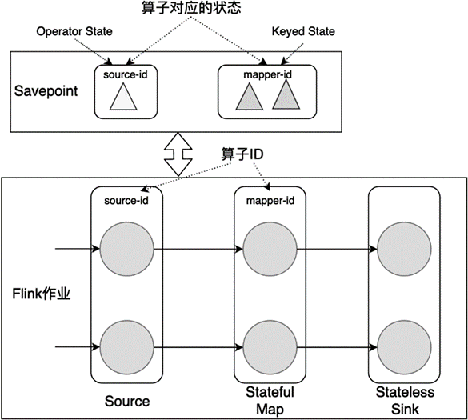
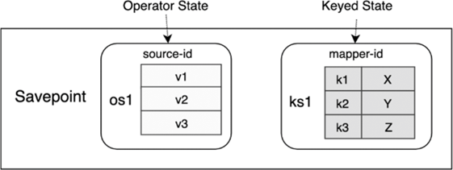

(savepoint)=
# Savepoint

:::{note}

本教程已出版为《Flink原理与实践》，感兴趣的读者请在各大电商平台购买！

<a href="https://item.jd.com/13154364.html">  </a>


:::

## Savepoint与Checkpoint的区别

目前，Checkpoint和Savepoint在代码层面使用的分布式快照逻辑基本相同，生成的数据也近乎一样，那这两个相似的名字到底有哪些功能性的区别呢？Checkpoint的目的是为了故障重启，使得作业中的状态数据与故障重启之前保持一致，是一种应对意外情况的有力保障。Savepoint的目的是手动备份数据，以便进行调试、迁移、迭代等，是一种协助开发者的支持功能。一方面，一个流处理作业不可能一次性就写好了，我们要在一个初版代码的基础上不断修复问题、增加功能、优化算法、甚至做一些机房迁移，一个程序是在迭代中更新的；另外一方面，流处理作业一般都是长时间运行的，作业内部的状态数据从零开始重新生成的成本很高，状态数据迁移成本高。综合这两方面的因素，Flink提供了Savepoint的机制，允许开发者调试开发有状态的作业。

Flink的Checkpoint机制设计初衷为：第一，Checkpoint过程是轻量级的，尽量不影响正常数据处理；第二，故障恢复越快越好。开发者需要进行的操作并不多，少量的操作包括：设置多大的间隔来定期进行Checkpoint，使用何种State Backend。绝大多数工作是由Flink来处理的，比如Flink会定期执行快照，发生故障后，Flink自动从最近一次Checkpoint数据中恢复。随着作业的关停，Checkpoint数据一般会被Flink删除，除非开发者设置了保留Checkpoint数据。原则上，一个作业从Checkpoint数据中恢复，作业的代码和业务逻辑不能发生变化。

相比而下，Savepoint机制主要考虑的是：第一，刻意备份，第二，支持修改状态数据或业务逻辑。Savepoint相关操作是有计划的、人为的。开发者要手动触发、管理和删除Savepoint。比如，将当前状态保存下来之后，我们可以更新并行度，修改业务逻辑代码，甚至在某份代码基础上生成一个对照组来验证一些实验猜想。可见，Savepoint的数据备份和恢复都有更高的时间和人力成本，Savepoint数据也必须有一定的可移植性，能够适应数据或逻辑上的改动。具体而言，Savepoint的潜在应用场景有：

* 我们可以给同一份作业设置不同的并行度，来找到最佳的并行度设置，每次可以从Savepoint中加载原来的状态数据。

* 我们想测试一个新功能或修复一个已知的bug，并用新的程序逻辑处理原来的数据。

* 进行一些A/B实验，使用相同的数据源测试程序的不同版本。

* 因为状态可以被持久化存储到分布式文件系统上，我们甚至可以将同样一份应用程序从一个集群迁移到另一个集群，只需保证不同的集群都可以访问这个文件系统。

可见，Checkpoint和Savepoint是Flink提供的两个相似的功能，它们满足了不同的需求，以确保一致性、容错性，满足了作业升级、BUG 修复、迁移、A/B测试等不同场景。

## Savepoint的使用方法

为了让Savepoint数据能够具有更好的兼容性和可移植性，我们在写一个Flink程序时需要为每个算子分配一个唯一ID。设置算子ID的目的在于将状态与Savepoint中的备份相对应。如下图所示，这个Flink作业共有三个算子：Source、Stateful Map和Stateless Sink。Source和Stateful Map分别有对应Operator State和Keyed State，Stateless Sink没有状态。



在实现这个数据流图时，我们需要给算子设置ID：

```java
DataStream<X> stream = env.
  // 一个带有Operator State的Source，例如Kafka Source
  .addSource(new StatefulSource()).uid("source-id") // 算子ID
  .keyBy(...)
  // 一个带有Keyed State的Stateful Map
  .map(new StatefulMapper()).uid("mapper-id") // 算子ID
  // print是一种无状态的Sink
  .print(); // Flink为其自动分配一个算子ID
```

上面的例子中，我们给算子设置了ID。如果代码中不明确设置算子ID，那么Flink会为其自动分配一个ID。严格来说，我们应该为每个算子都设置ID，因为很多算子内在实现上是有状态的，比如窗口算子。除非我们能够非常确认某个算子无状态，可以不为其设置ID。

如果我们想对这个作业进行备份，我们需要使用命令行工具执行下面的命令：

```bash
$ ./bin/flink savepoint <jobId> [savepointDirectory]
```

这行命令将对一个正在运行的作业触发一次Savepoint的备份，备份数据将写到`savepointDirectory`上。例如，我们可以指定一个HDFS路径作为Savepoint数据存放地址。

如果我们想从一个Savepoint数据中恢复一个作业，我们需要执行：

```bash
$ ./bin/flink run -s <savepointPath> [OPTIONS] <xxx.jar>
```

## 读写Savepoint中的数据

Flink提供了一个名为State Processor API的功能，允许开发者读写Savepoint中的数据。它主要基于DataSet API，将Savepoint数据从远程存储读到内存中，对Savepoint数据进行处理，然后再保存到远程存储上。有了State Processor API，开发者在状态的修改和更新上有更大的自由度。例如，开发者可以先从其他位置读取数据，生成一份Savepoint，交给一个没有数据积累的流处理程序，用来做数据冷启动。

将上节提到的程序中的Savepoint进一步分解，其内在存储形式如下图所示。Savepoint对数据的存储就像数据库存储数据一样，数据是按照一定的模式来组织和存储的。名为`source-id`的算子使用的是一个Operator State，Operator State的名字为`os1`，`os1`中的数据以一个列表的形式存储；名为`mapper-id`的算子使用的是一个Keyed State，Keyed State的名字为`ks1`，`ks1`中的数据是Key-Value对。



建立好上述的数据模型后，我们就可以像从数据库中读写数据那样，使用State Processor API来读写Savepoint中的数据。

State Processor API默认没有放在Flink的核心库中，使用之前需要先在`pom.xml`中引入正确的依赖：

```
<dependency>
  <groupId>org.apache.flink</groupId>
  <artifactId>flink-state-processor-api_${scala.binary.version}</artifactId>
  <version>${flink.version}</version>
  <scope>provided</scope>
</dependency>
```

### 从Savepoint中读数据

首先，我们需要从一个存储路径上读取Savepoint。这里要使用批处理的DataSet API，执行环境为`ExecutionEnvironment`。

```java
// 使用批处理DataSet API的ExecutionEnvironment
ExecutionEnvironment bEnv = ExecutionEnvironment.getExecutionEnvironment();
// 存储这个Savepoint所使用的State Backend
StateBackend backend = ...
ExistingSavepoint savepoint = Savepoint.load(bEnv, "hdfs://path/", backend);

bEnv.execute("read");
```

上面的代码从存储路径上读取一个Savepoint，生成一个`ExistingSavepoint`。`ExistingSavepoint`是一个已经存在的Savepoint，这个类提供了一个从Savepoint中读取数据的入口。

#### Operator State

读取时Operator State，我们需要指定算子ID、Operator State名字、数据类型。下面的代码读取了`source-id`下的`os1`：

```java
DataSet<Integer> listState  = savepoint.readListState<>(
    "source-id",
    "os1",
    Types.INT);
```

`readListState`方法读取ListState，它在源代码中的签名为：

```java
public <T> DataSet<T> readListState(String uid, String name, TypeInformation<T> typeInfo) {
  ...
}

public <T> DataSet<T> readListState(
		String uid,
		String name,
		TypeInformation<T> typeInfo,
		TypeSerializer<T> serializer) {
  ...
}
```

其中，`uid`为上一节中我们设置的算子ID；`name`为这个状态的名字，我们在使用状态时，会在`ListStateDescriptor`里初始化一个名字；`typeInfo`为该状态的类型，用来进行序列化和反序列化；如果默认的序列化器不支持该类型，也可以传入一个自定义的序列化器。

UnionListState的读取方法与之类似：

```java
DataSet<Integer> listState  = savepoint.readUnionState<>(
    "my-uid",
    "union-state",
    Types.INT);
```

#### Keyed State

流处理中，Keyed State应用在一个`KeyedStream`上，需要在`StateDescriptor`中指定状态的名字和数据类型。例如，在一个流处理作业中，我们继承`KeyedProcessFunction`，实现下面两个状态：

```java
/**
  * StatefulFunctionWithTime继承KeyedProcessFunction
  * 接收Integer类型的输入，更新状态
  * 第一个泛型为KeyedStream中Key的类型
  * 第二个泛型为输入数据
  * 第三个泛型为输出数据
  */
public class StatefulFunctionWithTime extends KeyedProcessFunction<Integer, Integer, Void> {
 
   ValueState<Integer> state;
   ListState<Long> updateTimes;

   @Override
   public void open(Configuration parameters) {
      ValueStateDescriptor<Integer> stateDescriptor = new ValueStateDescriptor<>("state", Types.INT);
      state = getRuntimeContext().getState(stateDescriptor);

      ListStateDescriptor<Long> updateDescriptor = new ListStateDescriptor<>("times", Types.LONG);
      updateTimes = getRuntimeContext().getListState(updateDescriptor);
   }
 
   // 接收输入数据value，更新状态
   @Override
   public void processElement(Integer value, Context ctx, Collector<Void> out) throws Exception {
      state.update(value + 1);
      updateTimes.add(System.currentTimeMillis());
   }
}
```

现在这两个Keyed State已经存储到Savepoint中，从Savepoint中读取它们，我们需要设置算子ID、状态名字和序列化方式。具体到Keyed State的读取时，我们需要继承并实现`KeyedStateReaderFunction`，在这个函数类中使用`readKey`方法读取状态数据。下面的代码继承并实现`KeyedStateReaderFunction`，整个逻辑与上面代码中流处理使用Keyed State的过程有几分相似之处。

```java
// 定义一个存储状态的数据结构
public class KeyedState {
  public int key;
  public int value;
  public List<Long> times;
}
 
/**
  * 从Savepoint中读取Keyed State
  * 第一个泛型Integer为Keyed State中Key的类型
  * 第二个泛型KeyedState为输出数据
  */
public class ReaderFunction extends KeyedStateReaderFunction<Integer, KeyedState> {

  ValueState<Integer> state;
  ListState<Long> updateTimes;

  // 获取状态句柄
  @Override
  public void open(Configuration parameters) {
    ValueStateDescriptor<Integer> stateDescriptor = new ValueStateDescriptor<>("state", Types.INT);
    state = getRuntimeContext().getState(stateDescriptor);

    ListStateDescriptor<Long> updateDescriptor = new ListStateDescriptor<>("times", Types.LONG);
    updateTimes = getRuntimeContext().getListState(updateDescriptor);
  }
 
  // 读取状态数据
  @Override
  public void readKey(
    Integer key,
    Context ctx,
    Collector<KeyedState> out) throws Exception {
        
    KeyedState data = new KeyedState();
    data.key    = key;
    data.value  = state.value();
    data.times  = StreamSupport
      .stream(updateTimes.get().spliterator(), false)
      .collect(Collectors.toList());

    // 将数据输出到Collector中
    out.collect(data);
  }
}
```

读取Savepoint的主逻辑为：

```java
// 从Savepoint数据中读取Keyed State
// ReaderFunction需要继承并实现KeyedStateReaderFunction
DataSet<KeyedState> keyedState = savepoint.readKeyedState("mapper-id", new ReaderFunction());
```

从上面的例子中可以看到，`readKeyedState`需要传入算子的ID和一个`KeyedStateReaderFunction`的具体实现，它在源码中的签名为：

```java
/*
 * 从Savepoint数据中读取Keyed State
 * uid：算子ID
 * function：一个KeyedStateReaderFunction
 * K：Keyed State的Key类型
 * OUT：输出类型
 */
public <K, OUT> DataSet<OUT> readKeyedState(String uid, KeyedStateReaderFunction<K, OUT> function) {
  ...
}
```

`KeyedStateReaderFunction`允许我们从Savepoint中读取Keyed State数据，我们需要实现`open`方法和`readKey`方法。其中，我们必须在`open`方法中注册`StateDescriptor`，获取状态句柄；在`readKey`方法中逐Key读取数据，输出到`Collector`中。`KeyedStateReaderFunction`和这些方法在源码中的定义为：

```java
/**
  * 从Savepoint中读取Keyed State
  * 泛型K：Keyed State中Key的类型
  * 泛型OUT：输出数据
  */
public abstract class KeyedStateReaderFunction<K, OUT> extends AbstractRichFunction {
	/**
	 * 初始化方法，用来注册StateDescriptor，获取状态句柄
	 */
	public abstract void open(Configuration parameters) throws Exception;

	/**
	 * 从Keyed State中逐Key读取数据，输出到Collector
	 * 参数K为Keyed State中的每个Key
	 * 参数Context为上下文
	 * 参数Collector<OUT>用来收集输出，可以是零到多个输出
	 */
	public abstract void readKey(K key, Context ctx, Collector<OUT> out) throws Exception;

	/**
	 * 上下文Context 
	 * Context只在readKey时有效
	 */
	public interface Context {

		/**
		 * 返回当前Key所注册的Event Time Timer
		 */
		Set<Long> registeredEventTimeTimers() throws Exception;

		/**
		 * 返回当前Key所注册的Processing Time Timer
		 */
		Set<Long> registeredProcessingTimeTimers() throws Exception;
	}
}
```

### 向Savepoint中写入数据

我们也可以从零开始构建状态，向Savepoint中写入数据，这个功能非常适合作业的冷启动。英文常使用Bootstrap这个词描述冷启动的过程，因此Flink设计的类名都会带有Bootstrap字样。具体而言，构建一个新的Savepoint时，需要实现一个名为`BootstrapTransformation`的操作，`BootstrapTransformation`表示一个状态写入的过程。从另一个角度来讲，我们可以将`BootstrapTransformation`理解成流处理时使用的有状态的算子。下面是一个Savepoint构建过程的主逻辑示例：

```java
ExecutionEnvironment bEnv = ExecutionEnvironment.getExecutionEnvironment();

// 最大并行度
int maxParallelism = 128;
StateBackend backend = ...

// 准备好需要写入状态的数据
DataSet<Account> accountDataSet = bEnv.fromCollection(accounts);
DataSet<CurrencyRate> currencyDataSet = bEnv.fromCollection(currencyRates);
  
// 构建一个BootstrapTransformation，将accountDataSet数据写入
BootstrapTransformation<Account> transformation = OperatorTransformation
			.bootstrapWith(accountDataSet)
			.keyBy(acc -> acc.id)
			.transform(new AccountBootstrapper());

// 构建一个BootstrapTransformation，将currencyDataSet数据写入
BootstrapTransformation<CurrencyRate> broadcastTransformation = OperatorTransformation
			.bootstrapWith(currencyDataSet)
			.transform(new CurrencyBootstrapFunction());

// 创建两个算子，算子ID分别为accounts、currency
Savepoint
    .create(backend, maxParallelism)
    .withOperator("accounts", transformation)
    .withOperator("currency", broadcastTransformation)
    .write(savepointPath);

bEnv.execute("bootstrap");
```

`Savepoint.create(backend, maxParallelism)`创建了一个新的Savepoint。`withOperator`方法向这个Savepoint中添加新的算子，它的两个参数分别为算子ID和一个`BootstrapTransformation`。`transformation`和`broadcastTransformation`就是两个`BootstrapTransformation`对象实例，他们的功能在于去模拟一个流处理中的有状态的算子，并写入状态数据。总体来讲，向Savepoint中写入数据需要三步：

1. 准备好需要写入状态的数据`DataSet`。
2. 构建一个`BootstrapTransformation`，将第一步准备好的数据写入这个`BootstrapTransformation`。
3. 将构建好的`BootstrapTransformation`写入Savepoint。

Operator State和Keyed State的原理不同，因此所要实现的不同，下面将分别介绍这两种写入方式。

#### Operator State

对于Operator State，我们要实现`StateBootstrapFunction`来写入状态数据，重点是实现它的`processElement`方法。每个输入进来之后，`processElement`方法都会被调用一次。下面是一个案例：

```java
/**
  * 继承并实现StateBootstrapFunction
  * 泛型参数为输入类型
  */
public class SimpleBootstrapFunction extends StateBootstrapFunction<Integer> {

    private ListState<Integer> state;

    // 每个输入都会调用一次processElement，这里将输入加入到状态中
    @Override
    public void processElement(Integer value, Context ctx) throws Exception {
        state.add(value);
    }

    @Override
    public void snapshotState(FunctionSnapshotContext context) throws Exception {
    }
	
    // 获取状态句柄
    @Override
    public void initializeState(FunctionInitializationContext context) throws Exception {
        state = context.getOperatorState().getListState(new ListStateDescriptor<>("state", Types.INT));
    }
}
```

对应的主逻辑为：

```java
ExecutionEnvironment env = ExecutionEnvironment.getExecutionEnviornment();
DataSet<Integer> data = env.fromElements(1, 2, 3);

BootstrapTransformation transformation = OperatorTransformation
    // 使用data数据进行初始化
    .bootstrapWith(data)
    .transform(new SimpleBootstrapFunction());
```

#### Keyed State

对于Keyed State，我们要实现`KeyedStateBootstrapFunction`来写入状态数据。同样，每来一个输入，`processElement`都会被调用一次。下面的代码中，Key为`Account`中的`id`。

```java
/**
 * 表示账户信息的POJO类
 */
public class Account {
    public int id;
    public double amount;	
    public long timestamp;
}
 
/**
  * AccountBootstrapper继承并实现了KeyedStateBootstrapFunction
  * 第一个泛型Integer为Key类型
  * 第二个泛型Account为输入类型
  */
public class AccountBootstrapper extends KeyedStateBootstrapFunction<Integer, Account> {
    ValueState<Double> state;

    // 获取状态句柄
    @Override
    public void open(Configuration parameters) {
        ValueStateDescriptor<Double> descriptor = new ValueStateDescriptor<>("total",Types.DOUBLE);
        state = getRuntimeContext().getState(descriptor);
    }

    // 每个输入都会调用一次processElement
    @Override
    public void processElement(Account value, Context ctx) throws Exception {
        state.update(value.amount);
    }
}
```

对应的主逻辑为：

```java
ExecutionEnvironment bEnv = 
  ExecutionEnvironment.getExecutionEnvironment();

DataSet<Account> accountDataSet = bEnv.fromCollection(accounts);

BootstrapTransformation<Account> transformation = OperatorTransformation
    // 使用accountDataSet数据进行初始化
    .bootstrapWith(accountDataSet)
    .keyBy(acc -> acc.id)
    .transform(new AccountBootstrapper());

Savepoint
			.create(backend, 128)
			.withOperator("accounts", transformation)
			.write(savepointPath);
```

我们可以看看`KeyedStateBootstrapFunction`在源码中的签名：

```java
/**
  * 将Keyed State写入Savepoint
  * 第一个泛型K为Key类型
  * 第二个泛型IN为输入类型
  */
public abstract class KeyedStateBootstrapFunction<K, IN> extends AbstractRichFunction {

	private static final long serialVersionUID = 1L;

	/**
	 * 处理输入的每行数据，更新Keyed State
	 * Context可以用来构建时间相关属性
	 * 当这个作业在流处理端重启后，时间相关属性可以用来触发计算
	 */
	public abstract void processElement(IN value, Context ctx) throws Exception;

	/* 上下文 */
	public abstract class Context {

		// 访问时间，注册Timer
		public abstract TimerService timerService();

		// 返回当前Key
		public abstract K getCurrentKey();
	}
}
```

可以看到`KeyedStateBootstrapFunction`继承了`AbstractRichFunction`，它拥有RichFunction函数类的方法和属性，比如`open`方法等，因此实现起来也与在流处理中使用状态非常相似。`processElement`对每个输入数据进行处理，我们可以根据业务需要写入到Keyed State中。此外，该方法提供了上下文`Context`，里面包含了第五章[ProcessFunction](../chapter-time-window/process-function.md)中提到的`TimerService`。借助于`TimerService`，我们可以访问时间，注册Timer。这些Timer在当前写入Savepoint的过程并不会触发，仅当Savepoint恢复成一个流处理作业时被触发。

### 修改Savepoint

除了从零开始构建一个新的Savepoint，我们也可以从一个已有的Savepoint基础上做修改，然后再保存起来。比如，下面的代码从一个已存在的Savepoint中获取数据，进行修改，生成新的Savepoint。

```java
ExecutionEnvironment bEnv = 
  ExecutionEnvironment.getExecutionEnvironment();

DataSet<Integer> data = bEnv.fromElements(1, 2, 3);

BootstrapTransformation<Integer> transformation = OperatorTransformation
  .bootstrapWith(data)
  .transform(new ModifyProcessFunction());

Savepoint
  .load(bEnv, savepointPath, backend)
  // 删除名为currency的算子
  .removeOperator("currency")
  // 增加名为numbers的算子，使用transformation构建其状态数据
  .withOperator("number", transformation)
  // 新的Savepoint会写到modifyPath路径下
  .write(modifyPath);

bEnv.execute("modify");
```

其中，`removeOperator`方法将一个算子状态数据从Savepoint中删除，`withOperator`方法增加了一个算子。修改完之后，我们可以通过`write`方法，将数据写入一个路径之下。

## Queryable State和State Processor API

Flink提供的另外一个读取状态的API为Queryable State。使用Queryable State可以查询状态中的数据，其原理与State Processor API有相通之处。相比而下，两者侧重点各有不同，Queryable State重在查询状态，主要针对正在运行的线上服务，State Processor API可以修改状态，主要针对写入到Savepoint（或Checkpoint）中的数据。从侧重点上可以看到，两者所要解决的问题略有不同。感兴趣的读者前往官方查询Queryable State的使用方法。