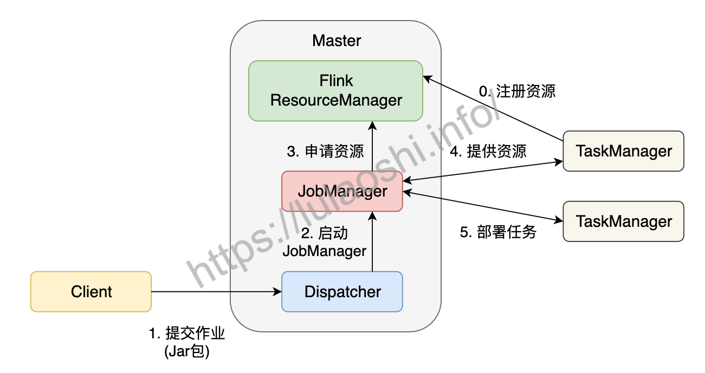
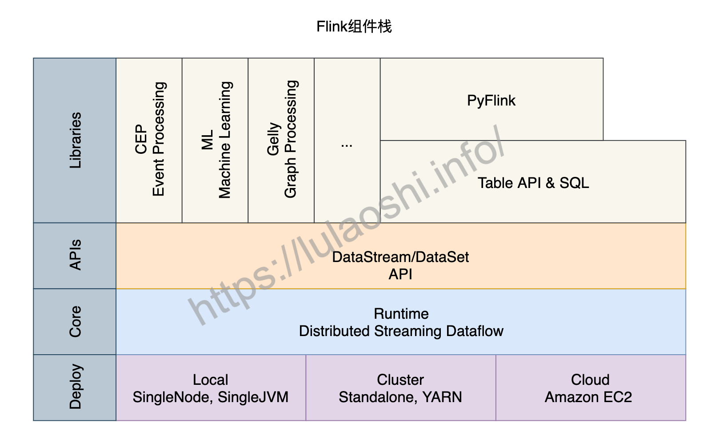

(flink-core)=
# 架构与核心组件

:::{note}

本教程已出版为《Flink原理与实践》，感兴趣的读者请在各大电商平台购买！

:::

为了支持分布式运行，Flink跟其他大数据引擎一样，采用了主从（Master-Worker）架构。Flink运行时主要包括两个组件：

• Master是一个Flink作业的主进程。它起到了协调管理的作用。

• TaskManager，又被称为Worker或Slave，是执行计算任务的进程。它拥有CPU、内存等计算资源。Flink作业需要将计算任务分发到多个TaskManager上并行执行。

下面将从作业执行层面来分析Flink各个模块如何工作。

## Flink作业提交过程

Flink为适应不同的基础环境（Standalone集群、YARN、Kubernetes），在不断的迭代开发过程中已经逐渐形成了一个兼容性很强的架构。不同的基础环境对计算资源的管理方式略有不同，不过都大同小异，下图以Standalone集群为例，分析作业的分布式执行流程。Standalone模式指Flink独占该集群，集群上无其他任务。

在一个作业提交前，Master和TaskManager等进程需要先被启动。我们可以在Flink主目录中执行脚本来启动这些进程：`bin/start-cluster.sh`。Master和TaskManager被启动后，TaskManager需要将自己注册给Master中的ResourceManager。这个初始化和资源注册过程发生在单个作业提交前，我们称之为第0步。

接下来我们根据上图，逐步分析一个Flink作业如何被提交：

1. 用户编写应用程序代码，并通过Flink客户端（Client）提交作业。程序一般为Java或Scala语言，调用Flink API，构建逻辑视角数据流图。代码和相关配置文件被编译打包，被提交到Master的Dispatcher，形成一个应用作业（Application）。

2. Dispatcher接收到这个作业，启动JobManager，这个JobManager会负责本次作业的各项协调工作。

3. JobManager向ResourceManager申请本次作业所需资源。

4. 由于在第0步中TaskManager已经向ResourceManager中注册了资源，这时闲置的TaskManager会被反馈给JobManager。

5. JobManager将用户作业中的逻辑视图转化为图所示的并行化的物理执行图，将计算任务分发部署到多个TaskManager上。至此，一个Flink作业就开始执行了。

TaskManager在执行计算任务过程中可能会与其他TaskManager交换数据，会使用图中的一些数据交换策略。同时，TaskManager也会将一些任务状态信息会反馈给JobManager，这些信息包括任务启动、运行或终止的状态，快照的元数据等。

##  Flink核心组件

有了这个作业提交流程，我们对各组件的功能应该有了更全面的认识，接下来我们再对涉及到的各个组件进行更为详细的介绍。

### Client

用户一般使用客户端（Client）提交作业，比如Flink主目录下的`bin`目录中提供的命令行工具。Client会对用户提交的Flink程序进行预处理，并把作业提交到Flink集群上。Client提交作业时需要配置一些必要的参数，比如使用Standalone集群还是YARN集群等。整个作业被打成了Jar包，DataStream API被转换成了`JobGraph`，`JobGraph`是一种类似逻辑视图。

### Dispatcher

Dispatcher可以接收多个作业，每接收一个作业，Dispatcher都会为这个作业分配一个JobManager。Dispatcher对外提供一个REST式的接口，以HTTP的形式来对外提供服务。

### JobManager

JobManager是单个Flink作业的协调者，一个作业会有一个JobManager来负责。JobManager会将Client提交的JobGraph转化为ExceutionGraph，ExecutionGraph是类似并行的物理执行图。JobManager会向ResourceManager申请必要的资源，当获取足够的资源后，JobManager将ExecutionGraph以及具体的计算任务分发部署到多个TaskManager上。同时，JobManager还负责管理多个TaskManager，这包括：收集作业的状态信息，生成检查点，必要时进行故障恢复等问题。
早期，Flink Master被命名为JobManager，负责绝大多数Master进程的工作。随着迭代和开发，出现了名为JobMaster的组件，JobMaster负责单个作业的执行。本书中，我们仍然使用JobManager的概念，表示负责单个作业的组件。一些Flink文档也可能使用JobMaster的概念，读者可以将JobMaster等同于JobManager看待。

### ResourceManager

如前文所说，Flink现在可以部署在Standalone、YARN或Kubernetes等环境上，不同环境中对计算资源的管理模式略有不同，Flink使用一个名为ResourceManager的模块来统一处理资源分配上的问题。在Flink中，计算资源的基本单位是TaskManager上的任务槽位（Task Slot，简称槽位Slot）。ResourceManager的职责主要是从YARN等资源提供方获取计算资源，当JobManager有计算需求时，将空闲的Slot分配给JobManager。当计算任务结束时，ResourceManager还会重新收回这些Slot。

### TaskManager

TaskManager是实际负责执行计算的节点。一般地，一个Flink作业是分布在多个TaskManager上执行的，单个TaskManager上提供一定量的Slot。一个TaskManager启动后，相关Slot信息会被注册到ResourceManager中。当某个Flink作业提交后，ResourceManager会将空闲的Slot提供给JobManager。JobManager获取到空闲Slot信息后会将具体的计算任务部署到该Slot之上，任务开始在这些Slot上执行。在执行过程，由于要进行数据交换，TaskManager还要和其他TaskManager进行必要的数据通信。

总之，TaskManager负责具体计算任务的执行，启动时它会将Slot资源向ResourceManager注册。

## Flink组件栈

了解Flink的主从架构、作业提交以及核心组件等知识后，我们再从更宏观的角度来对Flink的组件栈分层剖析。如下图所示，Flink的组件栈分为四层：部署层、运行时层、API层和上层工具。

### 部署层

Flink支持多种部署方式，可以部署在单机(Local)、集群(Cluster)，以及云（Cloud）上。

* Local模式

Local模式有两种不同的方式，一种是单节点（SingleNode），一种是单虚拟机（SingleJVM）。

Local-SingleJVM模式大多是开发和测试时使用的部署方式，该模式下JobManager和TaskManager都在同一个JVM里。

Local-SingleNode模式下，JobManager和TaskManager等所有角色都运行在一台机器上，虽然是按照分布式集群架构进行部署，但是集群的节点只有1个。该模式大多是在测试或者IoT设备上进行部署时使用。

* Cluster模式

Flink作业投入到生产环境下一般使用Cluster模式，可以是Standalone的独立集群，也可以是YARN或Kubernetes集群。

对于一个Standalone集群，我们需要在配置文件中配置好JobManager和TaskManager对应的机器，然后使用Flink主目录下的脚本启动一个Standalone集群。我们将在9.1.1详细介绍如何部署一个Flink Standalone集群。Standalone集群上只运行Flink作业。除了Flink，绝大多数企业的生产环境运行着包括MapReduce、Spark等各种各样的计算任务，一般都会使用YARN或Kubernetes等方式对计算资源进行管理和调度。Flink目前已经支持了YARN、Mesos以及Kubernetes，开发者提交作业的方式变得越来越简单。

* Cloud模式

Flink也可以部署在各大云平台上，包括Amazon、Google和阿里云。

### 运行时层

运行时（Runtime）层为Flink各类计算提供了实现。这一层读本章提到的分布式执行进行了支持。Flink Runtime层是Flink最底层也是最核心的组件。

### API层

API层主要实现了流处理DataStream API和批处理DataSet API。目前，DataStream API针对有界和无界数据流，DataSet API针对有界数据集。用户可以使用这两大API进行数据处理，包括转换（Transformation）、连接（Join）、聚合（Aggregation）、窗口（Window）以及状态（State）的计算。

### 上层工具

在DataStream和DataSet两大API之上，Flink还提供了更丰富的工具，包括：

* 面向流处理的：复杂事件处理（Complex Event Process，CEP）。

* 面向批处理的：机器学习计算库（Machine Learning, ML）、图计算库（Graph Processing, Gelly）。

* 面向SQL用户的Table API和SQL。数据被转换成了关系型数据库式的表，每个表拥有一个表模式（Schema），用户可以像操作表那样操作流式数据，例如可以使用SELECT、JOIN、GROUP BY等操作。

* 针对Python用户推出的PyFlink，方便Python社区使用Flink。目前，PyFlink主要基于Java的Table API之上。