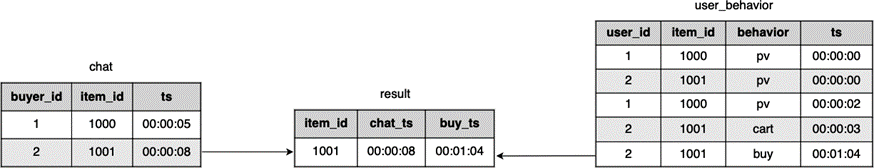
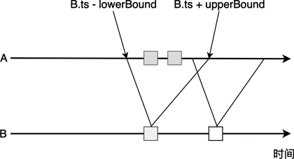
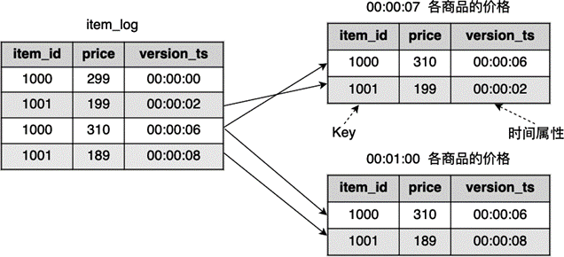
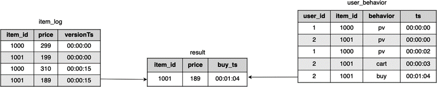
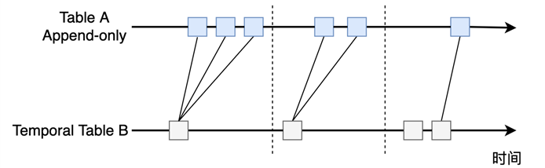
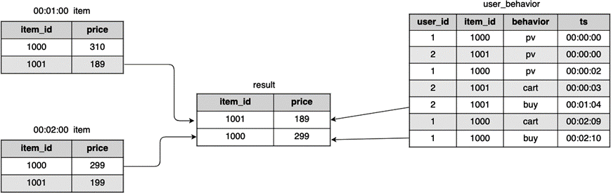

(sql-join)=
# Join

:::{note}

本教程已出版为《Flink原理与实践》，感兴趣的读者请在各大电商平台购买！

<a href="https://item.jd.com/13154364.html">  </a>


:::

Join是SQL中最常用的数据处理机制，它可以将两个数据源中的相关行相互连接起来。常用的Join方式有：`INNER JOIN`、`LEFT/RIGHT/FULL OUTER JOIN`。不同的Join决定了两个数据源连接方式的不同。在批处理上，对静态的数据上进行Join已经比较成熟，常用的算法有：嵌套循环（Nested Join）、排序合并（Sort Merge）、哈希合并（Hash Merge）等。这里以嵌套循环为例解释一下Join的实现原理。

假设我们有这样一个批处理查询：

```sql
SELECT 
	orders.order_id, 
	customers.customer_name, 
	orders.order_date
FROM orders INNER JOIN customers 
ON orders.customer_id = customers.customer_id;
```

这个语句在两个确定的数据集上进行计算，它翻译成伪代码：

```
// 循环遍历orders的每个元素
for row_order in orders:
  // 循环遍历customers的每个元素
	for row_customer in customers:
		if row_order.customer_id = row_customer.customer_id
			return (row_order.order_id, row_customer.customer_mame, row_order.order_date)
	end
end
```

嵌套循环的基本原理是使用两层循环，遍历表中的每个元素，当两个表中的数据相匹配时，返回结果。我们知道，一旦数据量增大，嵌套循环算法会产生非常大的计算压力。之前多次提到，流处理场景下数据是不断生成的，一旦数据源有更新，相应的Dynamic Table也要随之更新，进而重新进行一次上述的循环算法，这对流处理来说是一个不小的挑战。

目前，Flink提供了三种基于Dynamic Table的Join：时间窗口Join（Time-windowed Join）、临时表Join（Temporal Table Join）和传统意义上的Join（Regular Join）。这里我们先介绍前两种流处理中所特有的Join，了解前两种流处理的特例可以让我们更好地理解传统意义上的Join。

## Time-windowed Join

在电商平台，我们作为客户一般会先和卖家聊天沟通，经过一些对话之后才会下单购买。这里我们做一个简单的数据模型，假设一个关于聊天对话的数据流`chat`表记录了买家首次和卖家的聊天信息，它包括以下字段：买家ID（buyer_id），商品ID（item_id），时间戳（ts）。如果买家从开启聊天到最后下单的速度比较快，说明这个商品的转化率比较高，非常值得进一步分析。我们想统计这些具有较高转化率的商品，比如统计从首次聊天到用户下单购买的时间小于1分钟。



图中，左侧为记录用户首次聊天的数据流`chat`表，它有两个字段：`buyer_id`、`item_id`和`ts`,右侧为我们之前一直使用的`user_behavior`。我们以`item_id`字段来对两个数据流进行Join，同时还增加一个时间窗口的限制，即首次聊天发生之后1分钟内用户有购买行为。相应的SQL语句如下：

```sql
SELECT 
    user_behavior.item_id,
    user_behavior.ts AS buy_ts
FROM chat, user_behavior
WHERE chat.item_id = user_behavior.item_id
    AND user_behavior.behavior = 'buy'
    AND user_behavior.ts BETWEEN chat.ts AND chat.ts + INTERVAL '1' MINUTE;
```

Time-windowed Join其实和第五章中的Interval Join比较相似，可以用下图来解释其原理。我们对A和B两个表做Join，需要对B设置一个上下限，A表中所有界限内的数据都要与B表中的数据做连接。



一个更加通用的模板为：

```sql
SELECT 
    *
FROM A, B
WHERE A.id = B.id
    AND A.ts BETWEEN B.ts - lowBound AND B.ts + upperBound;
```

从语法中可以读出，`BETWEEN ... AND ...`设置了一个时间窗口，B表中某个元素的窗口为：[B.ts - lowBound, B.ts + upperBound]的闭区间，如果A表元素恰好落在这个区间，则该元素与B中这个元素连接。其中，A和B都使用时间属性进行上述窗口操作。此外，我们还需要等于谓词来进行匹配，比如`A.id = B.id`，否则大量数据会被连接到一起。

除了使用`BETWEEN ... AND ...`来确定窗口起始结束点外，Flink也支持比较符号 `>, <, >=, <=`，所以，一个时间窗口也可以被写为`A.ts >= B.ts - lowBound AND A.ts <= B.ts + upperBound`这样的语法。

:::info
A表和B表必须是Append-only模式的表，即只可以追加，不可以更新。
:::

在实现上，Flink使用状态来存储一些时间窗口相关数据。时间一般接近单调递增（Event Time模式不可能保证百分百的单调递增）。过期后，这些状态数据会被清除。当然，使用Event Time意味着窗口要等待更长的时间才能关闭，状态数据会更大。

## Temporal Table Join

电商平台的商品价格有可能发生变化，假如我们有一个商品数据源，里面有各个商品的价格变动，它由`item_id`、`price`和`version_ts`组成，其中，`price`为当前的价格，`version_ts`为价格改动的时间戳。一旦一件商品的价格有改动，数据都会追加到这个表中，这个表保存了价格变动的日志。如果我们想获取一件被购买的商品最近的价格，需要从这个表中找到最新的数据。这个表可以根据时间戳拆分为临时表（Temporal Table），Temporal Table如下图所示：



从图中可以看到，由于商品价格在更新，不同时间点的各商品价格不同。假如我们想获取00:00:07时刻各商品价格，得到的结果为右侧上表，如果获取00:01:00时刻各商品的价格，得到的结果为右侧下表。从图中拆解的过程可以看到，Temporal Table可以让我们获得某个时间点的信息，就像整个数据的一个子版本，版本之间通过时间属性来区分。

对于Temporal Table来说，数据源必须是一个Append-only的追加表，表中有一个Key作为唯一标识，数据追加到这个表后，我们可以根据Key来更新Temporal Table。上图中的表使用`item_id`作为Key。每行数据都有一个时间属性，用来标记不同的版本，时间属性可以是Event Time也可以是Processing Time。上图中的表使用`version_ts`作为时间属性字段。

总结下来，定义一个Temporal Time需要注意以下几点：

* 数据源是一个Append-only的追加表
* 定义Key，Key用来做唯一标识
* 数据源中有时间属性字段，根据时间的先后来区分不同的版本

下面的代码生成Temporal Table，其中`registerFunction`方法对这个Temporal Table进行了注册，它定义了Key并指定了时间属性字段，我们将在用户自定义方法的章节中专门介绍`registerFunction`使用方法。

```java
DataStream<Tuple3<Long, Long, Timestamp>> itemStream = ...

// 获取 Table
Table itemTable = tEnv.fromDataStream(itemStream, "item_id, price, version_ts.rowtime");
// 注册 Temporal Table Function，指定时间属性和Key
tEnv.registerFunction("item", itemTable.createTemporalTableFunction("version_ts", "item_id"));
```

注册后，我们拥有了一个名为`item`的Temporal Table，接下来可以在SQL中对这个表进行Join：

```sql
SELECT 
	user_behavior.item_id,
	latest_item.price,
	user_behavior.ts
FROM 
	user_behavior, LATERAL TABLE(item(user_behavior.ts)) AS latest_item
WHERE user_behavior.item_id = latest_item.item_id 
	AND user_behavior.behavior = 'buy'
```

这个SQL语句筛选购买行为:`user_behavior.behavior = 'buy'`，Temporal Table `item(user_behavior.ts)`按照`user_behavior`表中的时间`ts`来获取该时间点上对应的`item`的版本，将这个表重命名为`latest_item`。这个SQL语句的计算过程如下图所示：



整个程序的Java实现如下：

```java
// userBehavior
DataStream<Tuple4<Long, Long, String, Timestamp>> userBehaviorStream = env
    .fromCollection(userBehaviorData)
    // 使用Event Time必须设置时间戳和Watermark
    .assignTimestampsAndWatermarks(new AscendingTimestampExtractor<Tuple4<Long, Long, String, Timestamp>>() {
        @Override
        public long extractAscendingTimestamp(Tuple4<Long, Long, String, Timestamp> element) {
          return element.f3.getTime();
        }
    });

// 获取Table
Table userBehaviorTable = tEnv.fromDataStream(userBehaviorStream, "user_id, item_id, behavior,ts.rowtime");
tEnv.createTemporaryView("user_behavior", userBehaviorTable);

// item
DataStream<Tuple3<Long, Long, Timestamp>> itemStream = env
    .fromCollection(itemData)
    .assignTimestampsAndWatermarks(new AscendingTimestampExtractor<Tuple3<Long, Long, Timestamp>>() {
        @Override
        public long extractAscendingTimestamp(Tuple3<Long, Long, Timestamp> element) {
          return element.f2.getTime();
        }
    });
Table itemTable = tEnv.fromDataStream(itemStream, "item_id, price, version_ts.rowtime");

// 注册 Temporal Table Function，指定时间戳和Key
tEnv.registerFunction(
    "item",
    itemTable.createTemporalTableFunction("version_ts", "item_id"));

String sqlQuery = "SELECT \n" +
    "   user_behavior.item_id," +
    "   latest_item.price,\n" +
    "   user_behavior.ts\n" +
    "FROM " +
    "   user_behavior, LATERAL TABLE(item(user_behavior.ts)) AS latest_item\n" +
    "WHERE user_behavior.item_id = latest_item.item_id" +
    "   AND user_behavior.behavior = 'buy'";

// 执行SQL语句
Table joinResult = tEnv.sqlQuery(sqlQuery);
DataStream<Row> result = tEnv.toAppendStream(joinResult, Row.class);
```

从时间维度上来看，Temporal Table Join的效果如下图所示。



将这个场景推广，如果想在其他地方使用Temporal Table Join，需要按照下面的模板编写SQL：

```sql
SELECT *
FROM A, LATERAL TABLE(B(A.ts))
WHERE A.id = B.id
```

使用时，要注意：

* A表必须是一个Append-only的追加表。
* B表的数据源必须是一个Append-only的追加表，且必须使用`registerFunction`将该表注册到Catalog中。注册时需要指定Key和时间属性。
* A表和B表通过Key进行等于谓词匹配：`A.id = B.id`。

在具体实现Temporal Table时，Flink维护了一个类似Keyed State的状态，某个Key值下会保存对应的数据。Event Time下，为了等待一些迟到数据，状态数据会更大一些。

## Regular Join

基于前面列举的两种时间维度上的Join，我们可以更好地理解传统意义上的Regular Join。对于刚刚的例子，如果商品表不是把所有改动历史都记录下来，而是只保存了某一时刻的最新值，那么我们应该使用Regular Join。如下图所示，`item`表用来存储当前最新的商品信息数据，00:02:00时刻，`item`表有了改动，Join结果如图中的`result`表。



实际上，大部分数据库都如图中左侧所示，只保存数据的最新值，而数据库的改动历史日志不会呈现给用户，仅用来做故障恢复。那么，对于这种类型的表，具体的SQL语句为：

```sql
SELECT 
		user_behavior.item_id,
    item.price
FROM 
		user_behavior, item
WHERE user_behavior.item_id = item.item_id
		AND user_behavior.behavior = 'buy'
```

Regular Join是最常规的Join，它不像Time-windowed Join和Temporal Table Join那样需要在SQL语句中考虑太多时间。它的SQL语法也和批处理中的Join一样，一般符合下面的模板：

```sql
SELECT *
FROM A INNER JOIN B
ON A.id = B.id
```

A和B可以是Append-only的追加表，也可以是可更新的Update表，A、B两个表中的数据可以插入、删除和更新。A、B表对应的元素都会被连接起来。在具体实现上，Flink需要将两个表都放在状态中存储。任何一个表有新数据加入，都会和另外表中所有对应行进行连接。因此，Regular Join适合输入源不太大或源数据增长量非常小的场景。我们可以配置一定的过期时间，超过这个时间后，数据会被清除。我们在[Dynamic Table](dynamic-table.md)节提到的使用下面的方法来设置过期时间：`tEnv.getConfig.setIdleStateRetentionTime(Time.hours(1), Time.hours(2))`。

目前，Flink可以支持`INNER JOIN`、`LEFT JOIN`、`RIGHT JOIN`和`FULL OUTER JOIN`，只支持等于谓词匹配：`ON A.id = B.id`。使用Regular Join时，尽量避免出现笛卡尔积式的连接。

:::info
在Regular Join中，我们无法`SELECT`时间属性，因为Flink SQL无法严格保证数据按照时间属性排序。如果我们想要`SELECT`时间字段，一个办法是在定义Schema时，不明确指定该字段为时间属性，比如使用SQL DDL定义时，不设置`WATERMARK FOR rowtime_column AS watermark_strategy_expression`。
:::