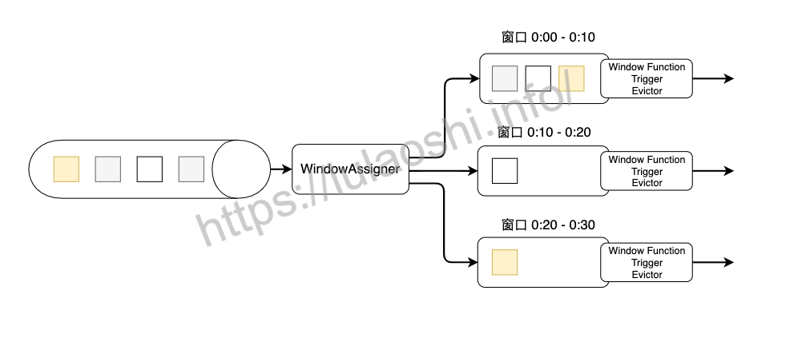
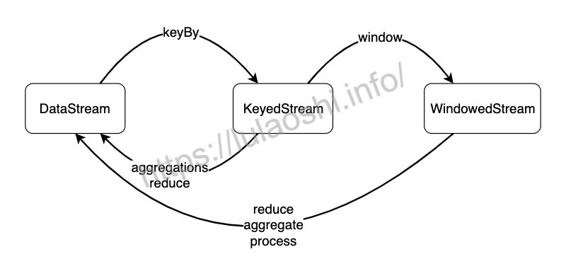
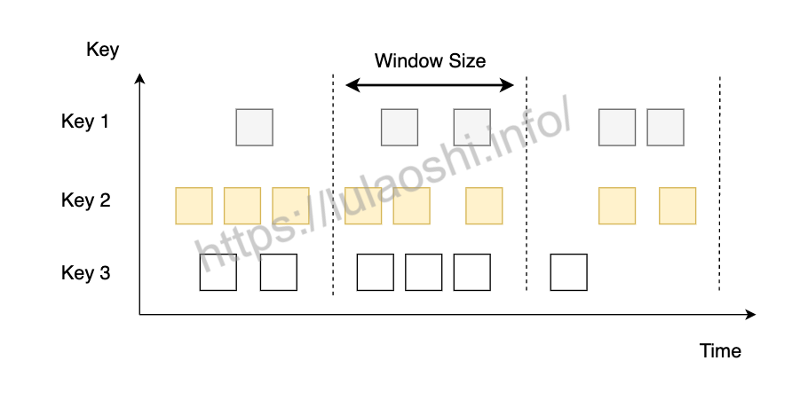
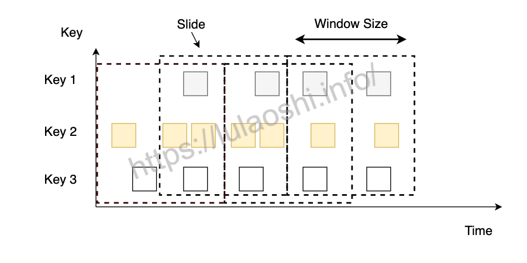
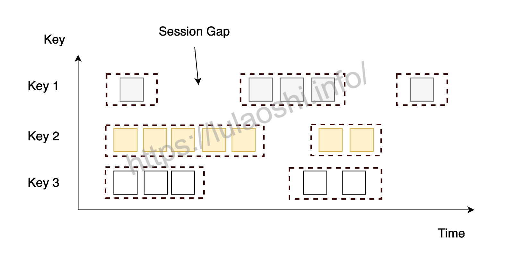
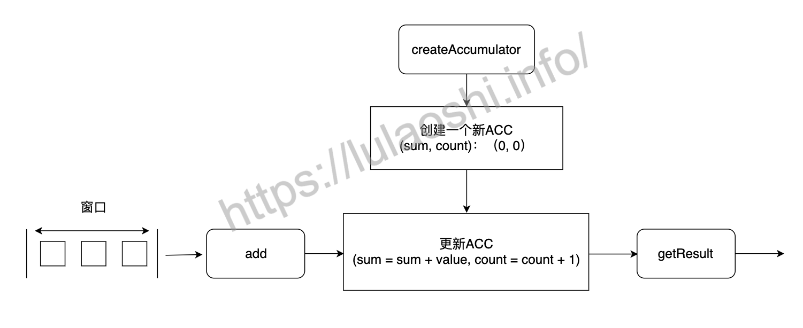

(window)=
# 窗口算子

:::{note}

本教程已出版为《Flink原理与实践》，感兴趣的读者请在各大电商平台购买！

<a href="https://item.jd.com/13154364.html">  </a>


:::

在批处理场景下，数据已经是按照某个时间维度分批次地存储了。一些公司经常将用户行为日志按天存储在一个文件目录下，另外一些开放数据集都会说明数据采集的时间始末。因此，对于批处理任务，处理一个数据集，其实就是对该数据集对应的时间窗口内的数据进行处理。

在流计算场景下，数据以源源不断的流的形式存在，数据一直在产生，没有始末。我们要对数据进行处理时，往往需要明确一个时间窗口，比如，数据在“每秒”、“每小时”、“每天”的维度下的一些特性。在一个时间窗口维度上对数据进行聚合，划分窗口是流处理需要解决的问题。Flink的窗口算子为我们提供了方便易用的API，我们可以将数据流切分成一个个窗口，对窗口内的数据进行处理。本节将介绍如何在Flink上进行窗口的计算。

## 窗口程序的骨架

一个Flink窗口程序的大致骨架结构如下所示：

```scala
// Keyed Window
stream
       .keyBy(<KeySelector>)           //  按照一个Key进行分组
       .window(<WindowAssigner>)       //  将数据流中的元素分配到相应的窗口中
      [.trigger(<Trigger>)]            //  指定触发器Trigger（可选）
      [.evictor(<Evictor>)]            //  指定清除器Evictor(可选)
       .reduce/aggregate/process()     //  窗口处理函数Window Function

// Non-Keyed Window
stream
       .windowAll(WindowAssigner)      //  不分组，将数据流中的所有元素分配到相应的窗口中
      [.trigger(<Trigger>)]            //  指定触发器Trigger（可选）
      [.evictor(<Evictor>)]            //  指定清除器Evictor(可选)
       .reduce/aggregate/process()     //  窗口处理函数Window Function
```

首先，我们要决定是否对一个`DataStream`按照Key进行分组，这一步必须在窗口计算之前进行。经过`keyBy()`的数据流将形成多组数据，下游算子的多个实例可以并行计算。`windowAll()`不对数据流进行分组，所有数据将发送到下游算子单个实例上。决定是否分组之后，窗口的后续操作基本相同，本文所涉及内容主要针对经过`keyBy()`的窗口（Keyed Window），经过`windowAll()`的是不分组的窗口（Non-Keyed Window），它们的原理和操作与Keyed Window类似，唯一的区别在于所有数据将发送给下游的单个实例，或者说下游算子的并行度为1。

Flink窗口的骨架程序中有两个必须的两个操作：

* 使用窗口分配器（WindowAssigner）将数据流中的元素分配到对应的窗口。
* 当满足窗口触发条件后，对窗口内的数据使用窗口处理函数（Window Function）进行处理，常用的Window Function有`reduce()`、`aggregate()`、`process()`。

其他的`trigger()`、`evictor()`则是窗口的触发和销毁过程中的附加选项，主要面向需要更多自定义的高级编程者，如果不设置则会使用默认的配置。

下图是窗口的生命周期示意图，假如我们设置的是一个10分钟的滚动窗口，第一个窗口的起始时间是0:00，结束时间是0:10，后面以此类推。当数据流中的元素流入后，窗口分配器会根据时间（Event Time或Processing Time）分配给相应的窗口。相应窗口满足了触发条件，比如已经到了窗口的结束时间，会触发相应的Window Function进行计算。注意，本图只是一个大致示意图，不同的Window Function的处理方式略有不同。



如下图所示，从数据类型上来看，一个`DataStream`经过`keyBy()`转换成`KeyedStream`，再经过`window()`转换成`WindowedStream`，我们要在之上进行`reduce()`、`aggregate()`或`process()`等Window Function，对数据进行必要的聚合操作。



## 内置的三种窗口划分方法

窗口主要有两种，一种基于时间（Time-based Window），一种基于数量（Count-based Window）。本文主要讨论Time-based Window，在Flink源码中，用`TimeWindow`表示。每个`TimeWindow`都有一个开始时间和结束时间，表示一个左闭右开的时间段。Flink为我们提供了一些内置的WindowAssigner，即滚动窗口、滑动窗口和会话窗口，接下来将一一介绍如何使用。

Count-based Window根据元素到达窗口的先后顺序管理窗口，到达窗口的先后顺序和Event Time并不一致，因此Count-based Window的结果具有不确定性。

### 滚动窗口

滚动窗口模式下窗口之间不重叠，且窗口长度（Size）是固定的。我们可以用`TumblingEventTimeWindows`和`TumblingProcessingTimeWindows`创建一个基于Event Time或Processing Time的滚动时间窗口。窗口的长度可以用`org.apache.flink.streaming.api.windowing.time.Time`中的`seconds`、`minutes`、`hours`和`days`来设置。



下面的代码展示了如何使用滚动窗口。代码中最后一个例子，我们在固定长度的基础上设置了偏移（Offset）。默认情况下，时间窗口会做一个对齐，比如设置一个一小时的窗口，那么窗口的起止时间是[0:00:00.000 - 0:59:59.999)。如果设置了Offset，那么窗口的起止时间将变为[0:15:00.000 - 1:14:59.999)。Offset可以用在全球不同时区设置上，如果系统时间基于格林威治标准时间（UTC-0），中国的当地时间可以设置offset为`Time.hours(-8)`。

```java
DataStream<T> input = ...

// 基于Event Time的滚动窗口
input
    .keyBy(<KeySelector>)
    .window(TumblingEventTimeWindows.of(Time.seconds(5)))
    .<window function>(...)

// 基于Processing Time的滚动窗口
input
    .keyBy(<KeySelector>)
    .window(TumblingProcessingTimeWindows.of(Time.seconds(5)))
    .<window function>(...)

// 在小时级滚动窗口上设置15分钟的Offset偏移
input
    .keyBy(<KeySelector>)
    .window(TumblingEventTimeWindows.of(Time.hours(1), Time.minutes(15)))
    .<window function>(...)
```

读者在其他的代码中可能看到过，时间窗口使用的是`timeWindow()`而非`window()`，比如，`input.keyBy(...).timeWindow(Time.seconds(1))`。`timeWindow()`是一种简写。当我们在执行环境设置了`TimeCharacteristic.EventTime`时，Flink对应调用`TumblingEventTimeWindows`；如果我们基于`TimeCharacteristic.ProcessingTime`，Flink使用`TumblingProcessingTimeWindows`。

### 滑动窗口

滑动窗口以一个步长（Slide）不断向前滑动，窗口的长度固定。使用时，我们要设置Slide和Size。Slide的大小决定了Flink以多快的速度来创建新的窗口，Slide较小，窗口的个数会很多。Slide小于窗口的Size时，相邻窗口会重叠，一个元素会被分配到多个窗口；Slide大于Size，有些元素可能被丢掉。



跟前面介绍的一样，我们使用`Time`类中的时间单位来定义Slide和Size，也可以设置offset。同样，`timeWindow()`是一种缩写，根据执行环境中设置的时间语义来选择相应的方法设置窗口。

```java
DataStream<T> input = ...

// 基于Event Time的滑动窗口
input
    .keyBy(<KeySelector>)
    .window(SlidingEventTimeWindows.of(Time.seconds(10), Time.seconds(5)))
    .<window function>(...)

// 基于Processing Time的滑动窗口
input
    .keyBy(<KeySelector>)
    .window(SlidingProcessingTimeWindows.of(Time.seconds(10), Time.seconds(5)))
    .<window function>(...)

// 在滑动窗口上设置Offset偏移
input
    .keyBy(<KeySelector>)
    .window(SlidingProcessingTimeWindows.of(Time.hours(12), Time.hours(1), Time.hours(-8)))
    .<window function>(...)
```

### 会话窗口

会话窗口模式下，两个窗口之间有一个间隙，被称为Session Gap。当一个窗口在大于Session Gap的时间内没有接收到新数据时，窗口将关闭。在这种模式下，窗口的长度是可变的，每个窗口的开始和结束时间并不是确定的。我们可以设置定长的Session Gap，也可以使用`SessionWindowTimeGapExtractor`动态地确定Session Gap的长度。



下面的代码展示了如何使用定长和变长的Session Gap来建立会话窗口，第二个和第四个例子展示了如何动态生成Session Gap。

```java
DataStream<T> input = ...

// 基于Event Time定长Session Gap的会话窗口
input
    .keyBy(<KeySelector>)
    .window(EventTimeSessionWindows.withGap(Time.minutes(10)))
    .<window function>(...)

// 基于Event Time变长Session Gap的会话窗口
input
    .keyBy(<KeySelector>)
    .window(EventTimeSessionWindows.withDynamicGap((element) -> {
        // 返回Session Gap的长度
    }))
    .<window function>(...)

// 基于Processing Time定长Session Gap的会话窗口
input
    .keyBy(<KeySelector>)
    .window(ProcessingTimeSessionWindows.withGap(Time.minutes(10)))
    .<window function>(...)


// 基于Processing Time变长Session Gap的会话窗口
input
    .keyBy(<KeySelector>)
    .window(ProcessingTimeSessionWindows.withDynamicGap((element) -> {
        // 返回Session Gap的长度
    }))
    .<window function>(...)
```

## 窗口函数

数据经过了`window()`和`WindowAssigner`之后，已经被分配到不同的窗口里，接下来，我们要通过窗口函数，在每个窗口上对窗口内的数据进行处理。窗口函数主要分为两种，一种是增量计算，如`reduce()`和`aggregate()`，一种是全量计算，如`process()`。增量计算指的是窗口保存一份中间数据，每流入一个新元素，新元素与中间数据两两合一，生成新的中间数据，再保存到窗口中。全量计算指的是窗口先缓存所有元素，等到触发条件后对窗口内的全量元素执行计算。

### ReduceFunction

使用`reduce()`时，我们要重写一个`ReduceFunction`。`ReduceFunction`在[DataStream API](../chapter-datastream-api/transformations.md)章节中已经介绍过，它接受两个相同类型的输入，生成一个输出，即两两合一地进行汇总操作，生成一个同类型的新元素。在窗口上进行`reduce()`的原理与之类似，只不过是在窗口元素上进行这个操作。窗口上的`reduce()`需要维护一个状态数据，这个状态数据的数据类型和输入的数据类型是一致的，是之前两两计算的中间结果数据。当数据流中的新元素流入后，`ReduceFunction`将中间结果和新流入数据两两合一，生成新的数据替换之前的状态数据。

```java
// 读入股票数据流
DataStream<StockPrice> stockStream = ...

senv.setStreamTimeCharacteristic(TimeCharacteristic.ProcessingTime)

// reduce的返回类型必须和输入类型StockPrice一致
DataStream<StockPrice> sum = stockStream
    .keyBy(s -> s.symbol)
    .timeWindow(Time.seconds(10))
    .reduce((s1, s2) -> StockPrice.of(s1.symbol, s2.price, s2.ts,s1.volume + s2.volume));
```

上面的代码使用Lambda表达式对两个元组进行操作，由于对symbol字段进行了`keyBy()`，相同symbol的数据都分组到了一起，接着我们在`reduce()`中将交易量加和，`reduce()`的返回的结果必须也是`StockPrice`类型。

使用`reduce()`的好处是窗口的状态数据量非常小，实现一个`ReduceFunction`也相对比较简单，可以使用Lambda表达式，也可以重写函数。缺点是能实现的功能非常有限，因为中间状态数据的数据类型、输入类型以及输出类型三者必须一致，而且只保存了一个中间状态数据，当我们想对整个窗口内的数据进行操作时，仅仅一个中间状态数据是远远不够的。

### AggregateFunction {#aggregate-function}

`AggregateFunction`也是一种增量计算窗口函数，也只保存了一个中间状态数据，但`AggregateFunction`使用起来更复杂一些。我们看一下它的源码定义：

```java
public interface AggregateFunction<IN, ACC, OUT> extends Function, Serializable {

   // 在一次新的aggregate发起时，创建一个新的Accumulator，Accumulator是我们所说的中间状态数据，简称ACC
   // 这个函数一般在初始化时调用
   ACC createAccumulator();

   // 当一个新元素流入时，将新元素与状态数据ACC合并，返回状态数据ACC
   ACC add(IN value, ACC accumulator);
  
   // 将两个ACC合并
   ACC merge(ACC a, ACC b);

   // 将中间数据转成结果数据
   OUT getResult(ACC accumulator);

}
```

根据上面的代码，这个类输入类型是IN，输出类型是OUT，中间状态数据是ACC，这样复杂的设计主要是为了解决输入类型、中间状态和输出类型不一致的问题。同时，ACC可以自定义，我们可以在ACC里构建我们想要的数据结构。比如我们要计算一个窗口内某个字段的平均值，那么ACC中要保存总和以及个数，下面是一个计算平均值的示例：

```scala
/**
  * 接收三个泛型：
  * IN: StockPrice
  * ACC：(String, Double, Int) - (symbol, sum, count)
  * OUT: (String, Double) - (symbol, average)
  */
public static class AverageAggregate implements AggregateFunction<StockPrice, Tuple3<String, Double, Integer>, Tuple2<String, Double>> {

    @Override
    public Tuple3<String, Double, Integer> createAccumulator() {
      	return Tuple3.of("", 0d, 0);
    }

    @Override
    public Tuple3<String, Double, Integer> add(StockPrice item, Tuple3<String, Double, Integer> accumulator) {
        double price = accumulator.f1 + item.price;
        int count = accumulator.f2 + 1;
        return Tuple3.of(item.symbol, price, count);
    }

    @Override
    public Tuple2<String, Double> getResult(Tuple3<String, Double, Integer> accumulator) {
      	return Tuple2.of(accumulator.f0, accumulator.f1 / accumulator.f2);
    }

    @Override
    public Tuple3<String, Double, Integer> merge(Tuple3<String, Double, Integer> a, Tuple3<String, Double, Integer> b) {
      	return Tuple3.of(a.f0, a.f1 + b.f1, a.f2 + b.f2);
    }
}
```

在主逻辑中按照下面的方式调用：

```java
DataStream<StockPrice> stockStream = ...

DataStream<Tuple2<String, Double>> average = stockStream
    .keyBy(s -> s.symbol)
    .timeWindow(Time.seconds(10))
    .aggregate(new AverageAggregate());
```

`AggregateFunction`里`createAccumulator`、`add`、`merge`这几个函数的工作流程如下图所示。在计算之前要创建一个新的ACC，ACC是中间状态数据，此时ACC里还未统计任何数据。当有新数据流入时，Flink会调用`add()`方法，更新ACC中的数据。当满足窗口结束条件时，Flink会调用`getResult()`方法，将ACC转换为最终结果。此外，还有一些跨窗口的ACC融合情况，比如，会话窗口模式下，窗口长短是不断变化的，多个窗口有可能合并为一个窗口，多个窗口内的ACC也需要合并为一个。窗口融合时，Flink会调用`merge()`，将多个ACC合并在一起，生成新的ACC。



### ProcessWindowFunction

与前两种方法不同，`ProcessWindowFunction`要对窗口内的全量数据都缓存。它在源码中的定义如下：

```java
/**
 * 函数接收四个泛型
 * IN   输入类型
 * OUT  输出类型
 * KEY  keyBy中按照Key分组，Key的类型
 * W    窗口的类型
 */
public abstract class ProcessWindowFunction<IN, OUT, KEY, W extends Window> extends AbstractRichFunction {

  /**
   * 对一个窗口内的元素进行处理，窗口内的元素缓存在Iterable<IN>，进行处理后输出到Collector<OUT>中
   * 我们可以输出一到多个结果
   */
	public abstract void process(KEY key, Context context, Iterable<IN> elements, Collector<OUT> out) throws Exception;
  
  /** 
    * 当窗口执行完毕被清理时，删除各类状态数据。
  	*/
	public void clear(Context context) throws Exception {}

  /**
   * 一个窗口的上下文，包含窗口的一些元数据、状态数据等。
   */
	public abstract class Context implements java.io.Serializable {
	
    // 返回当前正在处理的Window
		public abstract W window();

    // 返回当前Process Time
		public abstract long currentProcessingTime();

    // 返回当前Event Time对应的Watermark
		public abstract long currentWatermark();

    // 返回某个Key下的某个Window的状态
		public abstract KeyedStateStore windowState();

    // 返回某个Key下的全局状态
		public abstract KeyedStateStore globalState();

    // 迟到数据发送到其他位置
		public abstract <X> void output(OutputTag<X> outputTag, X value);
	}
}
```

使用时，我们需要实现`process()`方法，Flink将某个Key下某个窗口的所有元素都缓存在`Iterable<IN>`中，我们需要对其进行处理，然后用`Collector<OUT>`收集输出。我们可以使用`Context`获取窗口内更多的信息，包括时间、状态、迟到数据发送位置等。

下面的代码是一个`ProcessWindowFunction`的简单应用，我们对价格出现的次数做了统计，选出出现次数最多的输出出来。

```java
/**
  * 接收四个泛型：
  * IN: 输入类型 StockPrice
  * OUT: 输出类型 (String, Double)
  * KEY：Key String
  * W: 窗口 TimeWindow
  */
public static class FrequencyProcessFunction extends ProcessWindowFunction<StockPrice, Tuple2<String, Double>, String, TimeWindow> {

    @Override
    public void process(String key, Context context, Iterable<StockPrice> elements, Collector<Tuple2<String, Double>> out) {

        Map<Double, Integer> countMap = new HashMap<>();

        for (StockPrice element: elements) {
          	if (countMap.containsKey(element.price)) {
                int count = countMap.get(element.price);
                countMap.put(element.price, count + 1);
          } else {
            		countMap.put(element.price, 1);
          }
        }

        // 按照出现次数从高到低排序
        List<Map.Entry<Double, Integer>> list = new LinkedList<>(countMap.entrySet());
        Collections.sort(list, new Comparator<Map.Entry<Double, Integer>> (){
            public int compare(Map.Entry<Double, Integer> o1, Map.Entry<Double, Integer> o2) {
                if (o1.getValue() < o2.getValue()) {
                  	return 1;
                }
                else {
                  	return -1;
                }
            }
        });

        // 选出出现次数最高的输出到Collector
        if (list.size() > 0) {
          	out.collect(Tuple2.of(key, list.get(0).getKey()));
        }
    }
}
```

`Context`中有两种状态：一种是针对Key的全局状态，它是跨多个窗口的，多个窗口都可以访问，通过`Context.globalState()`获取；另一种是该Key下的单窗口的状态，通过`Context.windowState()`获取。单窗口的状态只保存该窗口的数据，主要是针对`process()`函数多次被调用的场景，比如处理迟到数据或自定义Trigger等场景。当使用单个窗口状态时，要在`clear()`方法中清理状态。

`ProcessWindowFunction`相比`AggregateFunction`和`ReduceFunction`的应用场景更广，能解决的问题也更复杂。但`ProcessWindowFunction`需要将窗口中所有元素缓存起来，这将占用大量的存储资源，尤其是在数据量大窗口多的场景下，使用不慎可能导致整个作业崩溃。假如每天的数据在TB级别，我们需要Slide为十分钟Size为一小时的滑动窗口，这种设置会导致窗口数量很多，而且一个元素会被复制好多份分给每个所属窗口，这将带来巨大的内存压力。

### ProcessWindowFunction与增量计算相结合

当我们既想访问窗口里的元数据，又不想缓存窗口里的所有数据时，可以将`ProcessWindowFunction`与增量计算函数`reduce()`和`aggregate()`相结合。对于一个窗口来说，Flink先增量计算，窗口关闭前，将增量计算结果发送给`ProcessWindowFunction`作为输入再进行处理。

下面的代码中，计算的结果保存在四元组`(股票代号，最大值、最小值，时间戳)`中，`reduce()`部分是增量计算，其结果传递给`WindowEndProcessFunction`，`WindowEndProcessFunction`只需要将窗口结束的时间戳添加到四元组的最后一个字段上即可。

```java
// 读入股票数据流
DataStream<StockPrice> stockStream = env
  	.addSource(new StockSource("stock/stock-tick-20200108.csv"));

// reduce的返回类型必须和输入类型相同
// 为此我们将StockPrice拆成一个四元组 (股票代号，最大值、最小值，时间戳)
DataStream<Tuple4<String, Double, Double, Long>> maxMin = stockStream
    .map(s -> Tuple4.of(s.symbol, s.price, s.price, 0L))
    .returns(Types.TUPLE(Types.STRING, Types.DOUBLE, Types.DOUBLE, Types.LONG))
    .keyBy(s -> s.f0)
    .timeWindow(Time.seconds(10))
    .reduce(new MaxMinReduce(), new WindowEndProcessFunction());

// 增量计算最大值和最小值
public static class MaxMinReduce implements ReduceFunction<Tuple4<String, Double, Double, Long>> {
        @Override
        public Tuple4<String, Double, Double, Long> reduce(Tuple4<String, Double, Double, Long> a, Tuple4<String, Double, Double, Long> b) {
            return Tuple4.of(a.f0, Math.max(a.f1, b.f1), Math.min(a.f2, b.f2), 0L);
        }
    }

// 利用ProcessFunction可以获取Context的特点，获取窗口结束时间
public static class WindowEndProcessFunction extends ProcessWindowFunction<Tuple4<String, Double, Double, Long>, Tuple4<String, Double, Double, Long>, String, TimeWindow> {
    @Override
    public void process(String key,
                        Context context,
                        Iterable<Tuple4<String, Double, Double, Long>> elements,
                        Collector<Tuple4<String, Double, Double, Long>> out) {
        long windowEndTs = context.window().getEnd();
        if (elements.iterator().hasNext()) {
            Tuple4<String, Double, Double, Long> firstElement = elements.iterator().next();
            out.collect(Tuple4.of(key, firstElement.f1, firstElement.f2, windowEndTs));
        }
    }
}
```

## 拓展和自定义窗口

经过前面的介绍，我们已经可以对数据流上的元素划分窗口，并在这个窗口上执行窗口函数。了解这些知识后，我们已经可以完成绝大多数业务需求。假如我们还需要进一步个性化窗口操作，比如提前执行窗口函数，或者定期清除窗口内的缓存，需要使用下面介绍的两个概念。


### Trigger

触发器（Trigger）决定了何时启动Window Function来处理窗口中的数据，以及何时将窗口内的数据清理。每个窗口都有一个默认的Trigger，比如前文这些例子都是基于Processing Time的时间窗口，当到达窗口的结束时间时，Trigger以及对应的计算被触发。如果我们有一些个性化的触发条件，比如窗口中遇到某些特定的元素、元素总数达到一定数量或窗口中的元素按照某种特定的模式顺序到达时，我们可以自定义一个Trigger来解决上述问题。我们甚至可以在Trigger中定义一些提前计算的逻辑，比如在Event Time语义中，虽然Watermark还未到达，但是我们可以定义提前输出的逻辑，以快速获取计算结果，获得更低的延迟。

我们先看Trigger返回一个什么样的结果。当满足某个条件，Trigger会返回一个名为`TriggerResult`的结果，`TriggerResult`是一个枚举类型，它有下面几种情况：

* CONTINUE：什么都不做。
* FIRE：启动计算并将结果发送给下游，不清理窗口数据。
* PURGE：清理窗口数据但不执行计算。
* FIRE_AND_PURGE：启动计算，发送结果然后清理窗口数据。

Trigger本质上是一种定时器Timer，我们需要考虑注册合适的时间，当到达这个时间时，Flink会启动Window Function，清理窗口数据。每个`WindowAssigner`都有一个默认的`Trigger`。比如基于Event Time的窗口会有一个`EventTimeTrigger`，每当窗口的Watermark时间戳到达窗口的结束时间，Trigger会发送`FIRE`。此外，`ProcessingTimeTrigger`对应Processing Time的窗口，`CountTrigger`对应Count-based的窗口。

当这些已有的Trigger无法满足我们的需求时，我们需要自定义Trigger，接下来我们看一下Flink的Trigger源码。

```java
/**
	* T为元素类型
	* W为窗口
  */
public abstract class Trigger<T, W extends Window> implements Serializable {

    // 窗口增加一个元素时调用onElement方法，返回一个TriggerResult
    public abstract TriggerResult onElement(T element, long timestamp, W window, TriggerContext ctx) throws Exception;

    // 当一个基于Processing Time的Timer触发了FIRE时被调用
    public abstract TriggerResult onProcessingTime(long time, W window, TriggerContext ctx) throws Exception;

    // 当一个基于Event Time的Timer触发了FIRE时被调用
    public abstract TriggerResult onEventTime(long time, W window, TriggerContext ctx) throws Exception;

    // 当窗口数据被清理时，调用clear方法来清理所有的Trigger状态数据
    public abstract void clear(W window, TriggerContext ctx) throws Exception

    /**
     * 上下文，保存了时间、状态、监控以及定时器
     */
    public interface TriggerContext {

        // 返回当前Processing Time
        long getCurrentProcessingTime();

        // 返回MetricGroup 
        MetricGroup getMetricGroup();

        // 返回当前Watermark时间
        long getCurrentWatermark();

        // 将某个time注册为一个Timer，当系统时间到达time这个时间点时，onProcessingTime方法会被调用
        void registerProcessingTimeTimer(long time);

        // 将某个time注册为一个Timer，当Watermark时间到达time这个时间点时，onEventTime方法会被调用
        void registerEventTimeTimer(long time);

        void deleteProcessingTimeTimer(long time);

        void deleteEventTimeTimer(long time);

        // 获取状态
        <S extends State> S getPartitionedState(StateDescriptor<S, ?> stateDescriptor);
    }

    ...
}
```

接下来我们以一个提前计算的案例来解释如何使用自定义的Trigger。在股票等交易场景中，我们比较关注价格急跌的情况，默认窗口长度是60秒，如果价格跌幅超过5%，则立即执行Window Function，如果价格跌幅在1%到5%之内，那么10秒后触发Window Function。

```scala
public static class MyTrigger extends Trigger<StockPrice, TimeWindow> {
    @Override
    public TriggerResult onElement(StockPrice element,
                                   long time,
                                   TimeWindow window,
                                   Trigger.TriggerContext triggerContext) throws Exception {
        ValueState<Double> lastPriceState = triggerContext.getPartitionedState(
            new ValueStateDescriptor<Double>("lastPriceState", Types.DOUBLE)
        );

        // 设置返回默认值为CONTINUE
        TriggerResult triggerResult = TriggerResult.CONTINUE;

        // 第一次使用lastPriceState时状态是空的,需要先进行判断
        // 如果是空，返回一个null
        if (null != lastPriceState.value()) {
            if (lastPriceState.value() - element.price > lastPriceState.value() * 0.05) {
                // 如果价格跌幅大于5%，直接FIRE_AND_PURGE
                triggerResult = TriggerResult.FIRE_AND_PURGE;
            } else if ((lastPriceState.value() - element.price) > lastPriceState.value() * 0.01) {
                // 跌幅不大，注册一个10秒后的Timer
                long t = triggerContext.getCurrentProcessingTime() + (10 * 1000 - (triggerContext.getCurrentProcessingTime() % 10 * 1000));
                triggerContext.registerProcessingTimeTimer(t);
            }
        }
        lastPriceState.update(element.price);
        return triggerResult;
    }

    // 这里我们不用EventTime，直接返回一个CONTINUE
    @Override
    public TriggerResult onEventTime(long time, TimeWindow window, Trigger.TriggerContext triggerContext) {
      	return TriggerResult.CONTINUE;
    }

    @Override
    public TriggerResult onProcessingTime(long time, TimeWindow window, Trigger.TriggerContext triggerContext) {
      	return TriggerResult.FIRE_AND_PURGE;
    }

    @Override
    public void clear(TimeWindow window, Trigger.TriggerContext triggerContext) {
      ValueState<Double> lastPriceState = triggerContext.getPartitionedState(
        new ValueStateDescriptor<Double>("lastPriceState", Types.DOUBLE)
      );
      	lastPriceState.clear();
    }
}
```

主逻辑中，我们继续使用之前计算平均数的聚合函数：

```java
DataStream<StockPrice> stockStream = ...

DataStream<Tuple2<String, Double>> average = stockStream
    .keyBy(s -> s.symbol)
    .timeWindow(Time.seconds(60))
    .trigger(new MyTrigger())
    .aggregate(new AverageAggregate());
```

从这个例子中可以看出，窗口中每增加一个元素，Flink都会调用Trigger中的`onElement`方法，这个方法里判断是否需要执行计算，并发送相应的`TriggerResult`。一次计算的执行可以基于某个元素满足了一定条件，比如时间到达了窗口边界；也可以基于之前注册的定时器。

在自定义Trigger时，如果使用了状态，一定要使用`clear`方法将状态数据清理，否则随着窗口越来越多，状态数据会越积越多。

:::info
假如我们使用了自定义的Trigger，那原来默认的触发逻辑会被自定义的逻辑覆盖。
:::

### Evictor

清除器（Evictor）是在`WindowAssigner`和`Trigger`的基础上的一个可选选项，用来清除一些数据。我们可以在Window Function执行前或执行后调用Evictor。

```java
/**
	* T为元素类型
	* W为窗口
  */
public interface Evictor<T, W extends Window> extends Serializable {

    // 在Window Function前调用
    void evictBefore(Iterable<TimestampedValue<T>> elements, int size, W window, EvictorContext evictorContext);

    // 在Window Function后调用
    void evictAfter(Iterable<TimestampedValue<T>> elements, int size, W window, EvictorContext evictorContext);

    // Evictor的上下文
    interface EvictorContext {
        long getCurrentProcessingTime();
        MetricGroup getMetricGroup();
        long getCurrentWatermark();
    }
}
```

`evictBefore`和`evictAfter`分别在Window Function之前和之后被调用，窗口的所有元素被放在了`Iterable<TimestampedValue<T>>`，我们要实现自己的清除逻辑。清除逻辑主要针对全量计算，对于增量计算的`ReduceFunction`和`AggregateFunction`，我们没必要使用Evictor。

一个清除的逻辑可以写成：

```java
for (Iterator<TimestampedValue<Object>> iterator = elements.iterator(); iterator.hasNext(); ) {
  TimestampedValue<Object> record = iterator.next();
  if (record.getTimestamp() <= evictCutoff) {
    iterator.remove();
  }
}
```

Flink提供了一些实现好的Evictor，例如：

* `CountEvictor`保留一定数目的元素，多余的元素按照从前到后的顺序先后清理。
* `TimeEvictor`保留一个时间段的元素，早于这个时间段的元素会被清理。